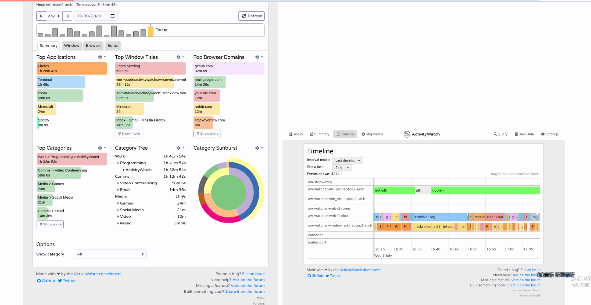

封面是北外滩拍的魔都三件套，天空自带滤镜，下面的停车场通道其实才是最佳拍摄点，其实不建议去外滩玩，人太多了，北外滩其实是不错的选择

<small>每周六早上发布，记录本周发现的不错的开源项目，偶尔分享下看到的书，不错的观点等</small>  

### 开源推荐

#### easyfind，mac上的everything替代品

习惯了使用everything，但平时在家用的是mac系统，没有everything，找了蛮久最后用了easyfind，聊胜于无吧。

在用这工具之前都是直接去终端拿find去找的，现在方便了许多。

#### ActivityWatch，掌控你的时间

可以记录你一天当中做了哪些时间，是一款时间追踪软件，缺点就是没有中文版

也提供了浏览器插件版本可以使用

所有的数据都是在你本地的，所以可以放心使用

#### Timer App，极简风计时器

这个也是mac上的一个小工具，用着还是蛮顺手的，有点类似番茄计时器

如果你是windows用户，那你可以直接用开源的番茄计时器，如：pomotroid，之前也有介绍过的

#### Material You NewTab 超酷炫浏览器新标签页

之前一直用的是edge自带的新标签页面，但是发现广告太多了

这个标签页你可以自己管理，而且是免费开源的， 可以放心使用，支持大部分常用的浏览器

#### Wealthfolio 投资展示台

最近大A很火，这款开源软件可以用来管理你的投资组合

界面简单美观，不同于市面上一些数据是存在云端，这款数据是完全在你本地的。

#### Maroto 创建自定义的pdf文件

这是一个用go语言写的可以完成pdf生成的库

完全免费开源使用，如果你日常用到pdf较多，可以去尝试下

如果你是go语言学习者，这个项目也值得去学习下。
### 书籍分享

#### 《时间贫困》

> “时间贫困”是一种普遍存在的感觉，即要做的事情太多而时间太少。 

> 可支配时间太少（如每天少于2小时）会带来压力，从而降低幸福感。 

> 可支配时间太多（如每天超过5小时）会让人缺乏目标感，从而降低幸福感。 

> 排除时间太少和太多的极端情况，幸福与你所拥有的可支配时间的长短无关，而是取决于你如何利用自己拥有的时间。

### 聊聊影视剧

最近在看《上甘岭》，最早知道这场战役，应该是在小学看到的邱少云烈士的文章，后来知道了范弗里特弹药量，知道了上甘岭的山被削下去几米，直到看到这部剧，了解到了更多，整个战役持续了43天，很惨烈，值得一看。

周末还看了《疯狂的麦克斯狂暴女神》，今年5月份上线的，因为很早之前看过了狂暴之路，确实也蛮期待的。有些评论讲不及狂暴之路，在我看来还是不错的，描述的世界观相对宏大。

