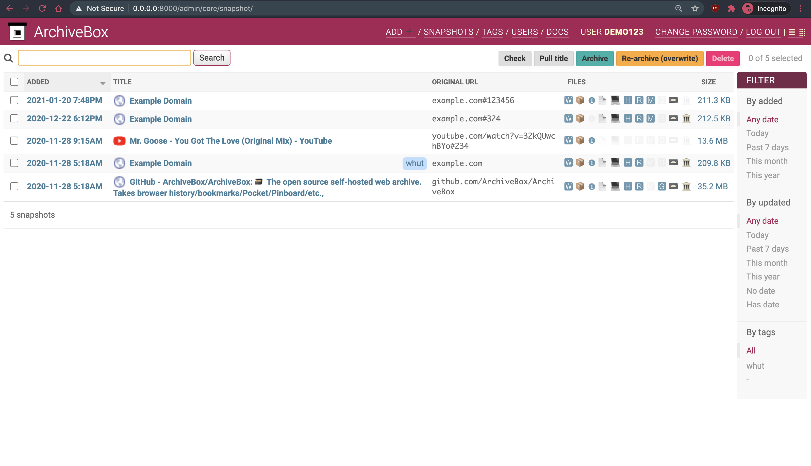
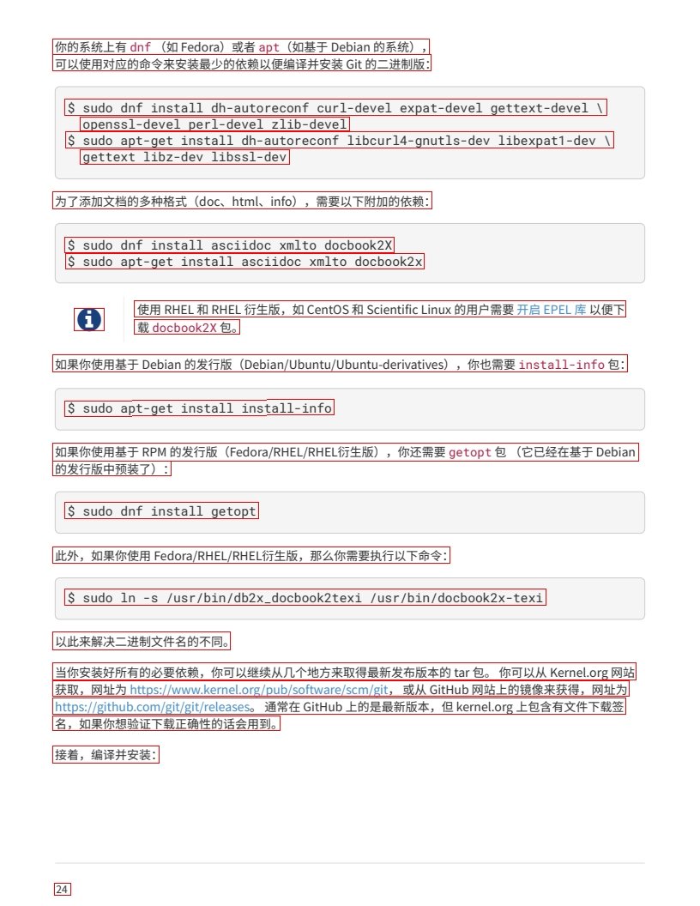
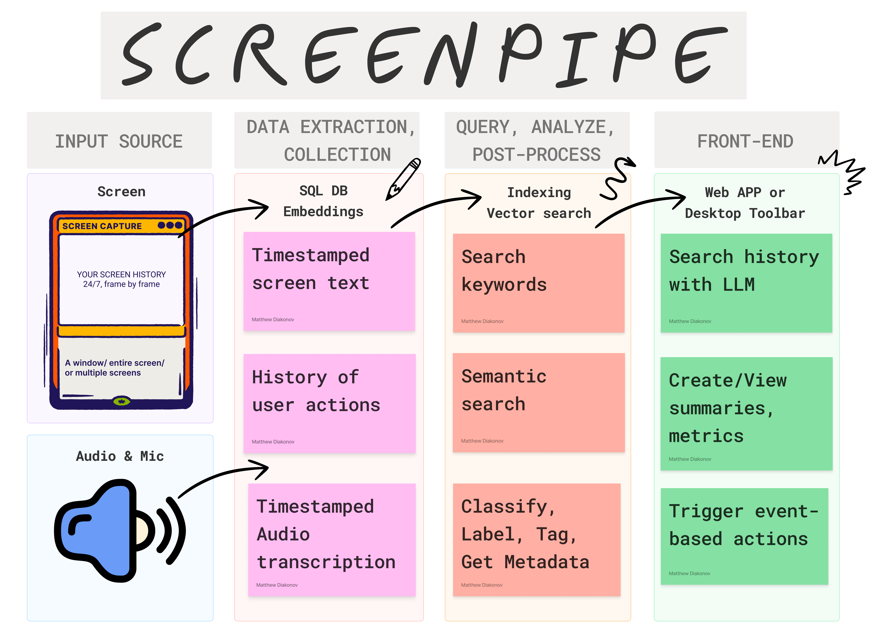
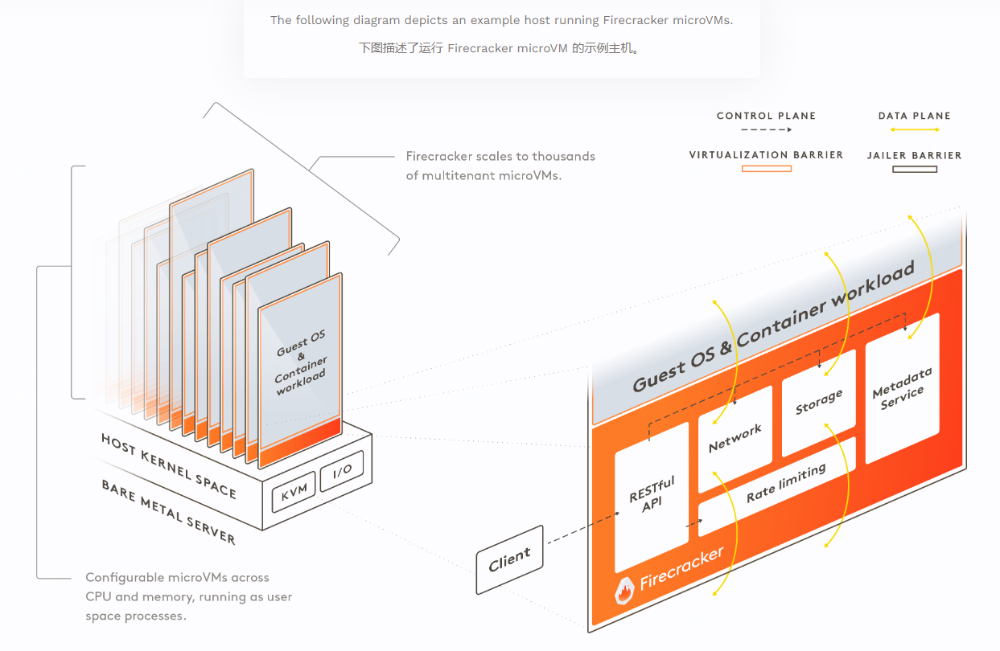
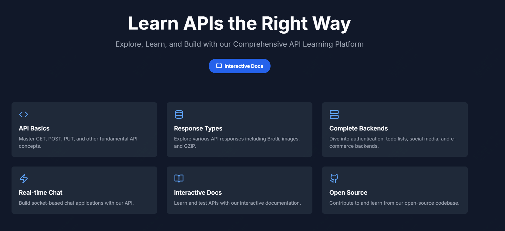

封面是近期刚整理完成的开源合集推荐，按照不同的功能划分了30多种，包括不限于开发工具、测试工具、运维工具、Ai工具等。

<small>本周刊每周六早上发布，记录本周发现的不错的开源项目，偶尔分享下看到的书，不错的观点等</small>  

### 开源推荐

如何快速的保存浏览器的内容，即使某天网站下线了，这些内容依旧保存在本地，看下ArchiveBox；如何像创建前端文件一样快速构建pdf文件，go语言库maroto可以帮助到你；更全面的ocr工具包，支持超过90多种语言，可以快速精确的提取文本；如果你喜欢RSS订阅，那么可以看下follow；如果你想要录制你的屏幕内容及音频信息，并且能够更加智能化的输出，那么可以看下screenpipe；Firecracker，亚马逊开源的虚拟化技术；如果你是开发人员，日常的api调试工作必不可少，那么apihub这款开源工具或许可以给你带来更舒服的体验；

#### ArchiveBox 开源的自托管网页归档解决方案

随着互联网内容的动态变化和页面的不断更新，许多重要的资源可能在不经意间被删除或更改，导致信息无法访问。

ArchiveBox 提供了一系列强大的功能，使得用户可以灵活管理和存储网页内容。

#### Maroto，go语言pdf库

如果你最近在学习go语言，那么可以看下这个项目

它可以快速创建pdf文件

支持各类组件如文本、图像、条形码、二维码、矩阵码、签名等，让你像调用api一样快速创建你想要的pdf文件

尤其对于开发人员来讲，可以快速将内容拼接为pdf

#### Surya：全面的OCR工具包

surya是一个OCR工具包，它支持超过90多种语言，该工具包可以在任何语言中检测行级文本，提供精确和准确的文本提取。

对于处理具有复杂布局和混合内容的文档可以提供更多的帮助。

#### Follow: 下一代RSS信息浏览器

follow是一个跨平台支持的RSS订阅工具

它支持包括 Windows、macOS、Linux 和浏览器，还即将推出 Android 和 iOS 版本。

而在AI时代，它也提供了更多的助力，如内容汇总，AI知识库等

#### screenpipe：本地 AI 屏幕和麦克风录制工具

screenpipe是一个可以全天7*24小时的录制你的屏幕任何操作，并且可以与大模型相结合完成一些AI自动化操作。

而且还内置 OCR 功能，支持中文和英文文本识别，方便用户从屏幕截图中提取文字信息。

#### Firecracker 亚马逊开源的虚拟化技术

Firecracker 的 microVM 尺寸非常小，占用的资源极少，并且启动速度极快，通常在几毫秒内即可启动。

它能够运行 Linux 和其他基于 KVM 的系统，但其轻量化设计确保了每个虚拟机只消耗最低限度的系统资源。

#### APIHub 开发者调试和管理 API 请求的有力工具

传统的 API 调试工具，如 Postman，虽然功能强大，但对于一些简单的需求可能显得过于复杂。

APIHub 通过提供一个简洁的命令行界面（CLI），让用户可以轻松地发送 HTTP 请求并查看响应，同时还支持自定义请求头、参数和请求体等。

### 书籍分享

#### 《刻意练习》

> 所有人都以为“杰出”源于“天赋”，“天才”却说：我的成就源于“正确的练习”！
>
>  大脑是可适应的，而训练可以创造一些我们以前并未拥有的技能（比如完美音高）。这是具有颠覆意义的观点，因为如今的学习变成了一种创造能力的方式，而不是使人们能学会充分利用他们的内在才华。
> 
> 在这个全新的世界，认为人们天生就具有一些固定潜力的观点已经站不住脚了；相反，潜力好比可延伸的血管，能够通过我们一生中经历的各种各样的事情来创造。学习不再是挖掘某人潜力的方式，而是发展这种潜力的方式。我们可以创造自己的潜力。

