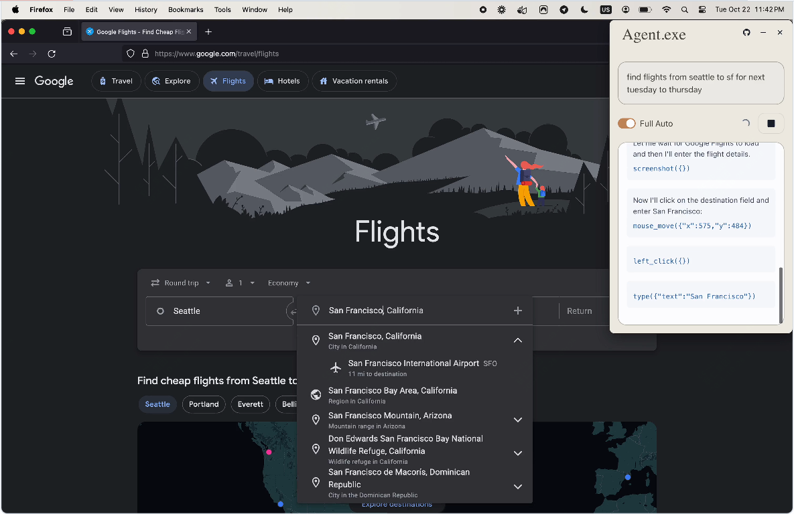
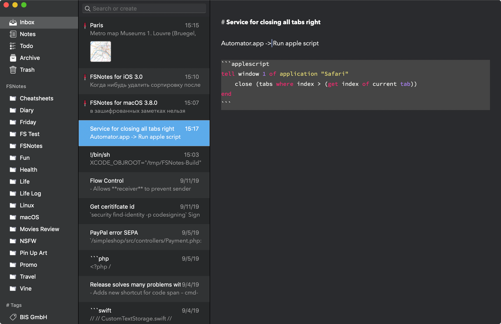
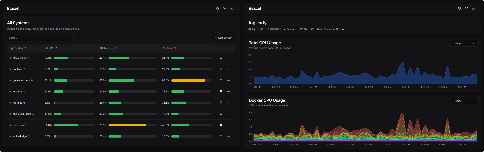
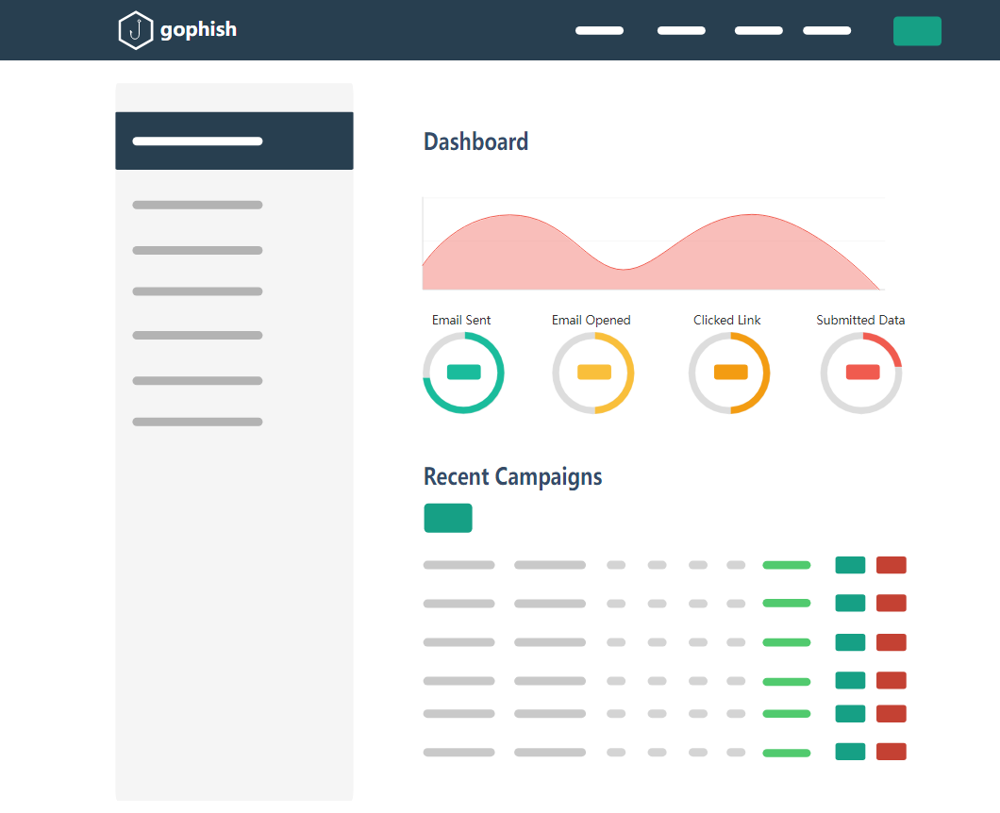
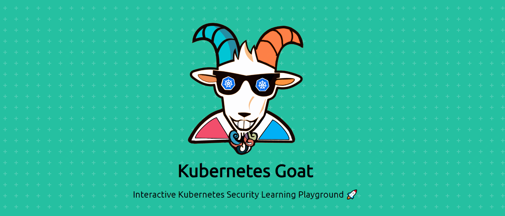
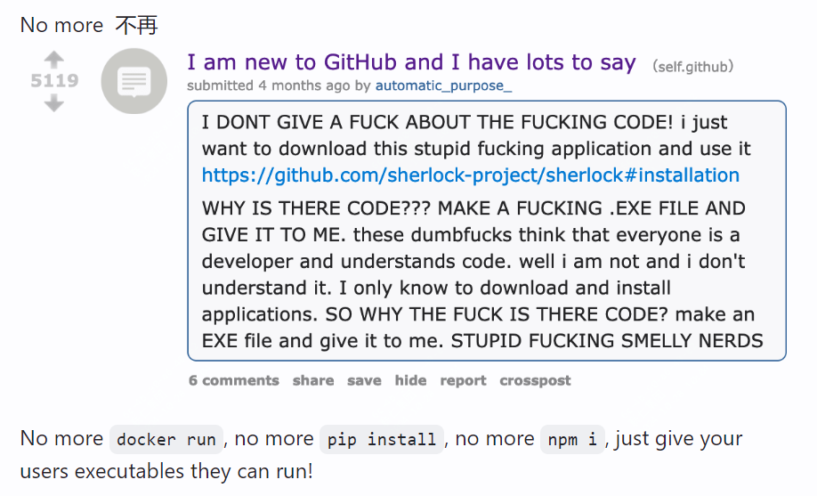

封面是加班后，回家路上等红绿灯拍的，这个摊只有晚上10点才会出来，围在旁边的有晚下班的打工人、有外卖员、还有附近的学生。

<small>本周刊每周六早上发布，记录本周发现的不错的开源项目，偶尔分享下看到的书，不错的观点等</small>  

### 开源推荐

本周汇总的6款开源工具包括通过Ai控制电脑、mac上的markdown笔记工具、docker监控软件、安全工作者平台、K8s安全工具以及一个docker镜像转为二进制文件的工具。

#### agent.exe AI控制你的电脑

agent.exe可以通过连接 Claude 3.5 Sonnet 来控制你的电脑，并通过指令下达来完成一些批量化的操作。

该工具用户界面很简洁，你只需要输入相关指令，就可以完成对应的操作，作者演示了如何购买一张机票。

#### FSNotes，mac上的markdown笔记软件

如果你是mac用户，还在寻找一款不错的笔记软件，那么这款开源软件值得去试一下。

它还是支持ios端，支持云端存储，可以在手机上随时记录一些内容。

该工具比较适合程序员，对代码高亮、编程语言的支持做了很多支持。

#### Beszel，轻量级的docker监控中心

称它为监控中心，是因为提供了agent端及hub端，可以汇集数据，并且提供可开放的api，可以对监控数据有更多的处理。

支持告警，支持历史数据统计，关键是这款监控工具体积很小，还提供了图表展示。

作为学习者，也可以作为一款不错的项目用来学习。

#### Gophish 安全钓鱼工具套装

这款开源软件是推荐给安全工作者的

它可以模拟发起钓鱼过程，简化钓鱼攻击的实施过程，使用户能够在短时间内创建和管理钓鱼活动，从而提高企业的安全意识和防护能力

界面很简洁，功能也比较实用。

#### Kubernetes Goat，K8s学习者必备工具

如果你在学习k8s，那么如何应对一些紧急情况？

正常在用的环境不可能作为测试使用，这款工具可以为你提供一个异常情况下的集群。

可以在真实的环境中模拟和体验各种安全漏洞和攻击场景

#### Dockerc 将docker镜像转换为一个二进制文件

Dockerc 是一个创新的工具，将 Docker 镜像编译为独立的便携式二进制文件。

这样你可以跳过很多依赖安装环节，直接运行二进制文件

在部分场景下还是挺有用的。

### 影视剧分享

#### 塔尔萨之王 

真的好看，上周末直接看完第一季，第二季看到了第六集。

目前第一季豆瓣评分8.4，第二季7.9，目前最近更新到了第七集。

故事主要讲意大利黑*，情节节奏真的快，看的很爽，关键主角是史泰龙已经78岁了

第一季相比第二季更加惊艳，值得一看

