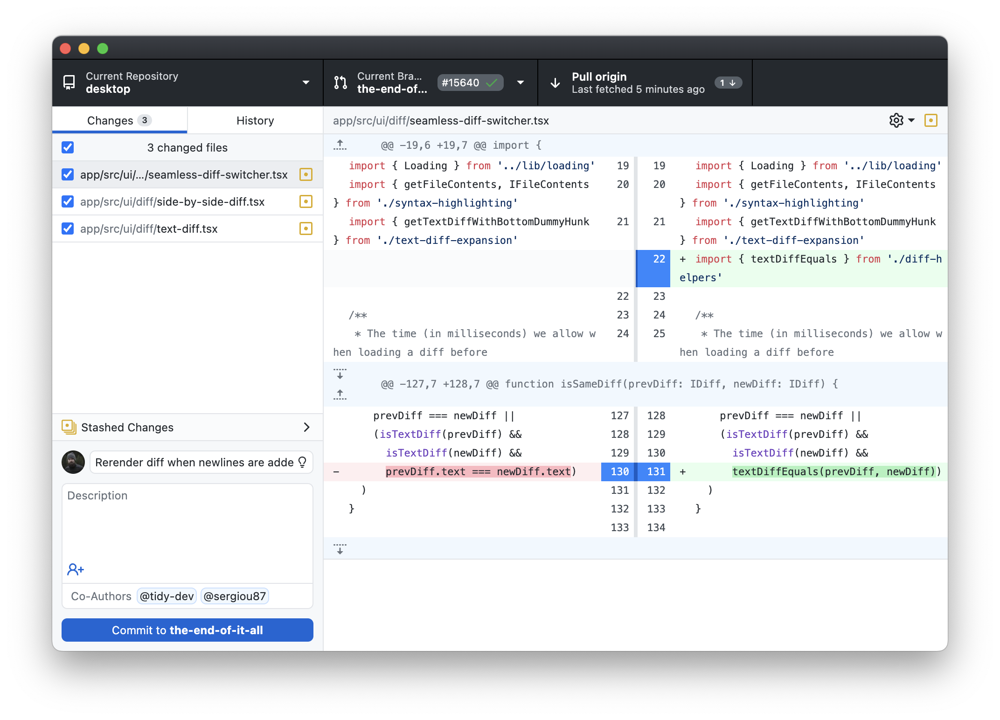
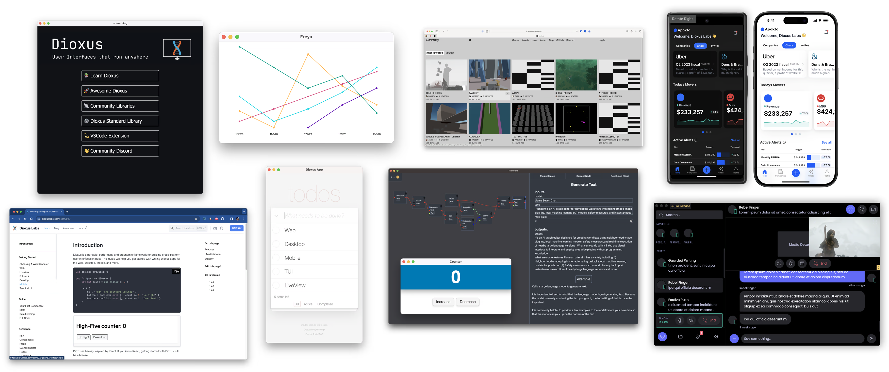
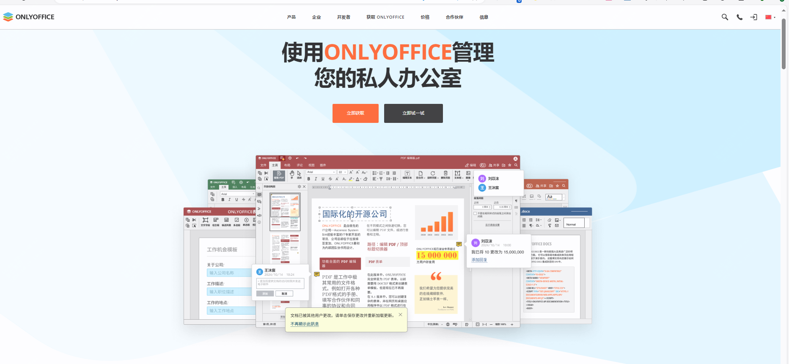

封面图是双十一当天拍的，双十一那天的11：11分，记得第一次双十一还是大一的时候，当天晚上学校网络都没有关！

而今年的双十一应该是最没有感觉的一次了，作为消费不如狗的中年男，双十一当天消费50，买了两张手机膜，还不是自己的

<small>本周刊每周六早上发布，分享我在本周找到的优秀开源项目、读到的有趣书籍和独特的观点等内容。</small>

---

### 本周开源推荐

本周挑选了7款有趣的开源工具，有前端项目fullpage、有git管理工具、有AI相关项目、也有windows调优工具，更具体的使用或者介绍，可以查看每天发布的文章。

#### fullPage.js

`fullPage.js` 是一个轻量级且功能强大的 JavaScript 库，能够轻松创建全屏滚动网站。它提供简单明了的 API，适合新手开发者使用。该库经过优化，确保滚动效果流畅，适配各种设备和浏览器。

#### GitHub Desktop

**GitHub Desktop** 是一个强大且直观的开源项目，旨在简化和优化 Git 版本控制的使用。通过 GitHub Desktop，开发者可以轻松地在桌面环境中进行代码管理、分支管理和协作，适用于各种技术水平的开发者。

#### OpenTofu

OpenTofu 是一个由 Linux 基金会托管的开源工具，旨在通过人类可读的配置文件来定义云端和本地资源。它允许���户对基础设施进行版本控制、重用和共享，从而实现高效、安全的基础设施管理。

#### Dioxus

Dioxus 是一个由 DioxusLabs 开发的全栈应用框架，旨在简化跨平台应用的开发。无论是 Web、桌面、移动端还是服务器应用，Dioxus 都能通过单一代码库进行构建，提供高性能和安全性。

### OnlyOffice

**OnlyOffice** 是一个开源的办公套件，旨在提供强大的文档编辑、表格处理和演示文稿功能。它支持多种文件格式，并允许用户在云端或本地服务器上进行协作。

### Win11Debloat

**Win11Debloat** 是一个开源工具，旨在帮助用户清理和优化 Windows 11 系统。通过移除不必要的预装应用和功能，用户可以提升系统性能和响应速度。

### Exo

**Exo** 是一个创新的项目，旨在让你在家中运行自己的 AI 集群，使用日常电子设备。这个项目由 exo-explore 组织维护，具有以下特点：

---

### 影视推荐

#### 大秦帝国之裂变、纵横、崛起

很早之前就看过了，属于二刷，同时也在看书，真正有些理解“奋六世之余烈”，这不仅是一部历史剧，更是对人性、权力与历史变迁的深刻反思，值得每位观众细细品味。

