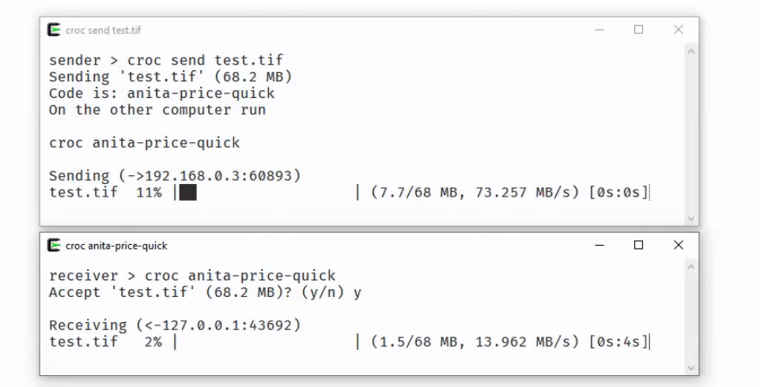
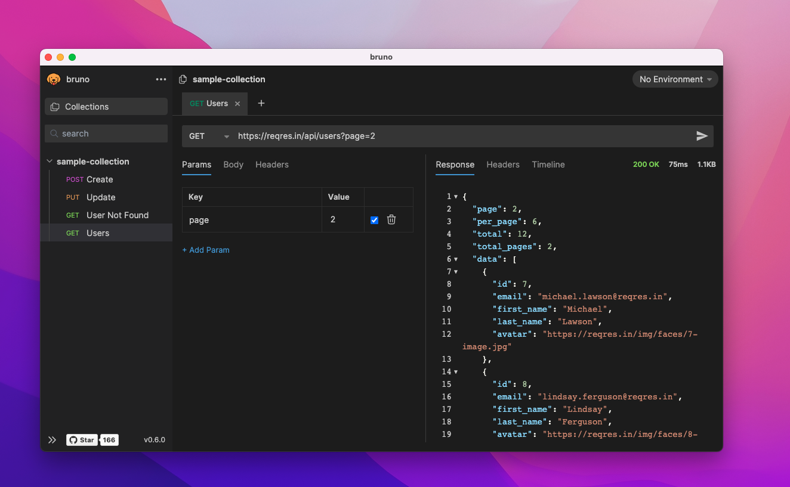
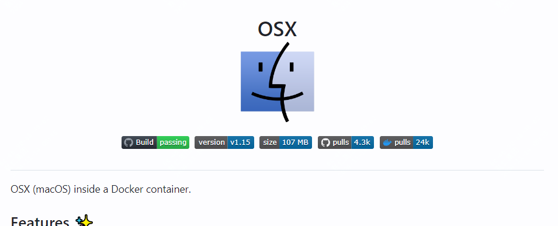
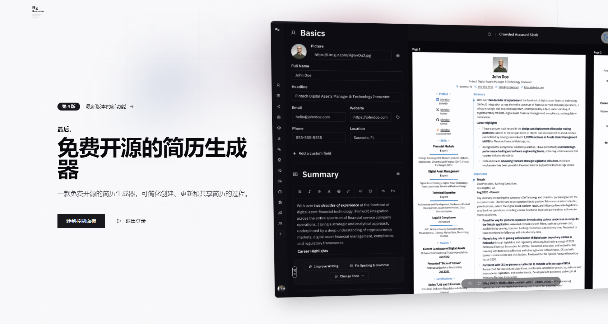
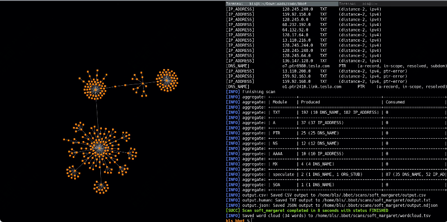

封面图是前段时间去苏州河拍的，蓝天白天，心情很好，偶尔出来走走，逃避下牛马的生活

<small>本周刊每周六早上发布，分享我在本周找到的优秀开源项目、读到的有趣书籍和独特的观点等内容。</small>

---

### 本周开源推荐

本周挑选了6款有趣的开源工具，如果你日常有非常多的文件传输需求，那么croc是一个不错的工具。还有开发人员必备的api调试工具，习惯了使用postman，换着用下bruno，它更加的轻量化。之前介绍过在docker中启动windows，同一个作者，发布了在docker中运行macos，值得一试。AI时代，简历自动生成很常见，但是这个开源项目更有亮点。bbot，安全工作者必备工具，它可以快速的扫描你的网络环境，并且可以生成对应的拓扑图。perspective，在大数据时代，尤其是大数据工作可以借鉴的一个项目。

#### croc

**croc** 是一个用 Go 语言编写的命令行文件传输工具，它允许任意两台计算机之间简单且安全地传输文件和文件夹。该工具支持端到端加密，**可跨平台使用（Windows、Linux、Mac）**，支持多文件传输和断点续传，无需本地服务器或端口转发，优先支持 IPv6 并提供 IPv4 回退，还可以使用代理（如 Tor）进行传输。其简单的命令行界面和独特的代码短语配对机制使得文件传输过程既安全又便捷。

#### bruno

该项目是一个开源的 API 开发和测试工具，专为提升开发者体验而设计，其现代化的界面与强大的功能相结合，支持灵活的请求管理、环境变量配置以及实时协作，同时通过本地运行确保数据安全，适用于快速调试和管理 API 请求的各种场景。

#### docker-macos

该项目是一个基于 Docker 容器的 macOS 虚拟化解决方案，让用户能够在 Linux 或 Windows 11 系统上通过 Docker 容器运行 macOS。它支持 KVM 加速以提供更好的性能，提供基于网页的远程访问界面，并且能够自动下载和安装所需的系统文件。该项目使用 Python 和 Shell 脚本开发，支持多个 macOS 版本（从 Big Sur 到 Sequoia），并提供了灵活的配置选项，如自定义 CPU 核心数、内存大小和磁盘容量等，适用于开发测试和虚拟化环境搭建。

#### Reactive-Resume

一个开源的简历生成器，采用现代化的 Web 技术构建，提供直观的编辑界面和高度可定制的模板，支持实时预览、多语言和离线导出功能，帮助用户快速创建专业且个性化的简历，适用于求职、个人展示及职业发展等场景。

#### bbot

BBOT是一个用Python编写的多功能互联网扫描工具，专注于自动化侦察(Recon)、漏洞赏金(Bug Bounty)和攻击面管理(ASM)。它的设计灵感来自Spiderfoot，提供了强大的子域名枚举、网络爬虫、邮箱收集和Web扫描等功能。该工具采用模块化架构，支持多种API集成，并具有直观的命令行界面，使得安全研究人员能够轻松地对目标进行全面的安全评估和资产发现。其独特的递归扫描能力和高度可配置性，使其在发现目标更多子域名方面的表现优于同类工具20-50%。

### perspective

Perspective 是一个专注于数据可视化和分析的开源组件库，其核心引擎使用 C++ 编写并编译到 WebAssembly、Python 和 Rust 平台。它特别适合处理大规模和/或流式数据集，提供了高性能的列式表达式语言，支持 Apache Arrow 格式的读写和流处理。该项目提供了框架无关的用户界面组件，可以在浏览器中通过 WebAssembly 直接运行，或通过 WebSocket 服务器（Python/Node）远程运行，同时还提供了 JupyterLab 插件支持，使其非常适合构建交互式数据分析报表、仪表盘和应用程序。

---

### 影视推荐

#### 甜蜜家园

Netflix韩剧《甜蜜家园》改编自同名网络漫画，讲述了人类变成怪物后的末日生存故事。该剧以精良的特效、紧张的剧情和深刻的人性探讨著称，目前已更新至第二季。这部作品完美展现了韩国在怪物题材和特效制作上的实力，同时也深入探讨了在极端环境下的人性考验。

