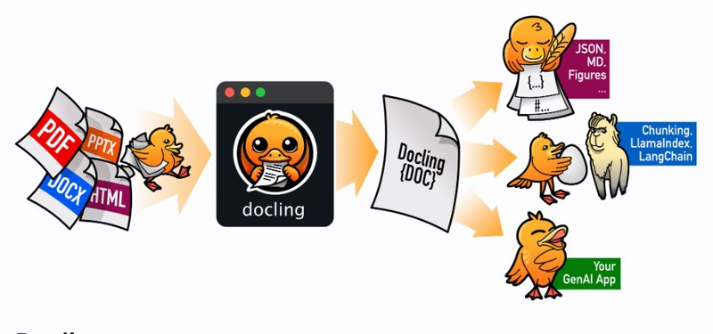
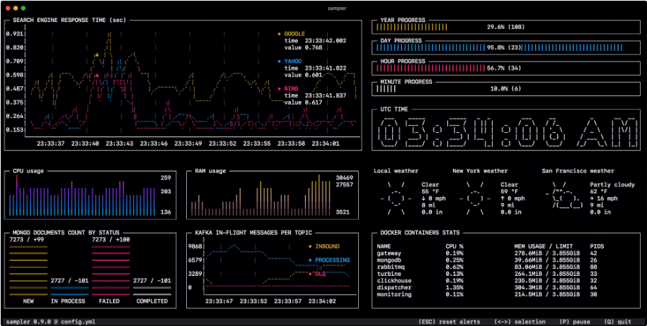
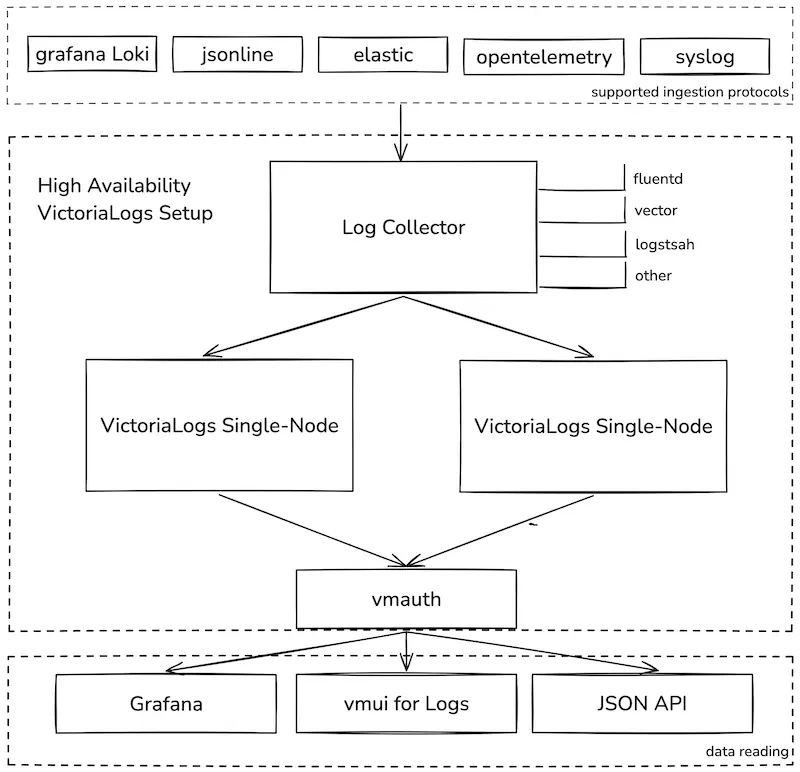
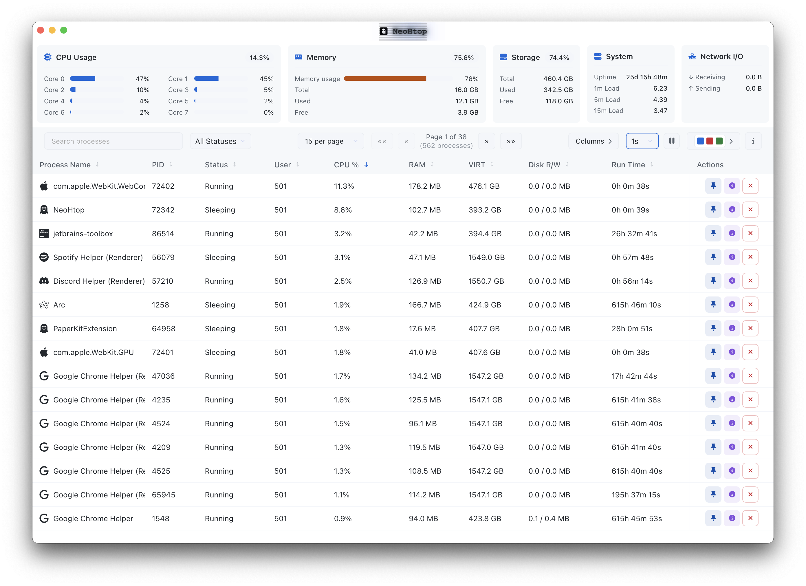
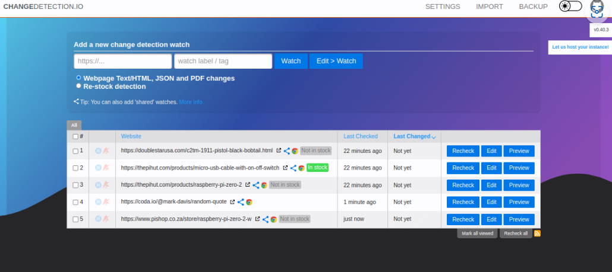

封面图是本月跑步的记录，10月跑了100公里，11月休息了几天估计只能到80km，跑步坚持了一年多了，开始减肥需求较大，目前的话其实主要还是为了健康，也慢慢成为了习惯。

<small>本周刊每周六早上发布，分享我在本周找到的优秀开源项目、读到的有趣书籍和独特的观点等内容。</small>

---

### 本周开源推荐

本周为大家精选了6款实用的开源工具。如果你需要处理和转换各类文档，Docling 可以帮你轻松将 PDF、DOCX 等格式转换为 Markdown。对于数据库开发者来说，ChartDB 提供了直观的数据库结构可视化功能。在系统监控方面，Sampler 和 neohtop 分别提供了命令行下的实时监控方案。如果你在寻找高性能的日志管理系统，VictoriaLogs 值得一试，它的性能可达到 Elasticsearch 的30倍。最后，changedetection.io 则是一个强大的网站内容监控工具，可以帮你追踪网页变化并及时通知。这些工具都各具特色，能够在不同场景下提升开发效率。

#### docling

**Docling** 是一个用 Python 开发的文档解析和格式转换工具，旨在简化多种文档格式（如 PDF、DOCX、PPTX 等）的处理。它支持将文档快速转换为统一的 Markdown 和 JSON 格式，提供简单易用的命令行界面，适合用于生成技术报告、文档管理和集成到 AI 应用中。Docling 具备先进的 PDF 理解能力，能够识别页面布局、阅读顺序和表格结构，确保用户在处理复杂文档时获得最佳效果。此外，Docling 还支持光学字符识别（OCR），能够提取扫描文档中的文字，进一步提升文档处理的灵活性。通过与 LlamaIndex 和 LangChain 的集成，Docling 扩展了其在检索增强生成（RAG）和问答（QA）应用中的使用场景。

#### chartdb

**ChartDB**是一款优秀的开源数据库图形编辑工具，专注于简化数据库结构的可视化设计。通过单一查询即可实现数据库模式的可视化，支持包括PostgreSQL、MySQL、SQL Server等多种主流数据库。该工具的突出特点包括即时模式导入、AI驱动的SQL导出功能，以及直观的交互式编辑界面。作为一个无需账户即可使用的工具，ChartDB为开发者提供了一种快速、高效的方式来探索和管理数据库结构，特别适合需要频繁进行数据库设计和文档化的开发团队。

#### sampler

Sampler 是一款轻量级的命令行实时监控工具，专为系统和应用程序监控而设计。它提供了高度可定制的仪表盘界面，支持多种数据可视化方式（如折线图、条形图、饼图等），让用户能够实时监控系统指标和应用状态。通过简单的 YAML 配置文件，用户可以轻松定制监控内容，支持从系统指标、日志文件、REST API 等多种数据源获取数据。作为一个便携式工具，Sampler 只需一个二进制文件即可运行，是开发和运维人员进行轻量级监控的理想选择。

#### victorialogs

VictoriaLogs是一个高性能的开源日志管理系统，由VictoriaMetrics团队开发。它具有以下突出特点：

- 性能卓越：单节点性能可达到Elasticsearch或Loki的30倍
- 智能配置：无需手动调优，可根据系统资源自动优化
- 兼容性强：完美支持Filebeat、Fluentbit、Fluentd等主流日志收集器
- 简单部署：支持二进制或Docker方式快速部署
- 查询便捷：提供Web UI界面，支持多种数据展示方式
- 存储高效：通过布隆过滤器和列式存储，可节省高达15倍存储空间

#### neohtop

neohtop是一个现代化的系统监控工具，它是传统top和htop命令的升级版本。这个用Rust开发的工具最初是为了解决作者在Mac上遇到的内存溢出问题而诞生的。通过采用TraitsUI构建的界面，neohtop提供了更为美观和直观的用户体验。

### changedetection

changedetection.io 是一个功能强大的开源网站监控工具，专注于网页内容变化的自动检测和通知。其核心功能使用 Python 开发，支持 Docker 容器化部署，可以轻松在本地或服务器上运行。它特别适合监控电商网站的价格变动、商品库存状态、软件更新日志等各类网页内容的变化。

---

### 影视推荐

#### 宿敌

《宿敌》国产警匪剧，讲述了一场持续19年的警匪追击战。廖凡饰演的警察与奇道饰演的犯罪分子展开了一场漫长的智慧与意志的较量。这不仅是一部关于正义与邪恶的对决，更是一个关于时间消耗、生命代价的故事。两位实力派演员的精湛演技让这场持久战更显张力，他们塑造的角色既对立又相似，在漫长的追逃过程中形成了独特的宿命关系。剧集深入探讨了"为何有人愿意放弃一切，孤军奋战"这一命题，展现了警察与罪犯之间复杂的纠葛与较量。

