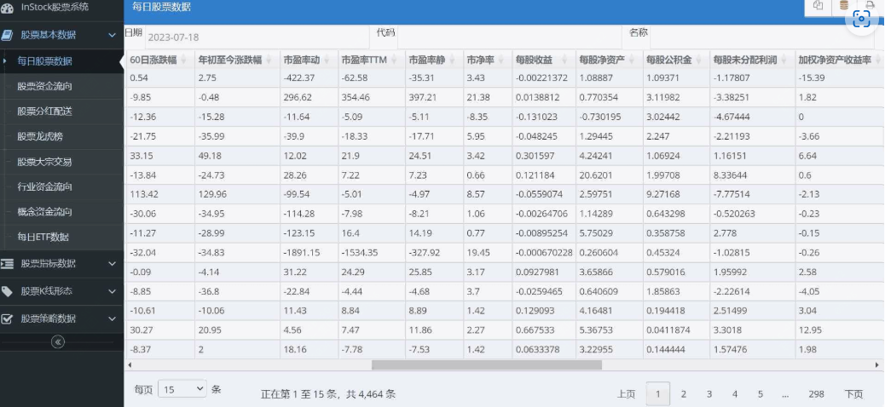
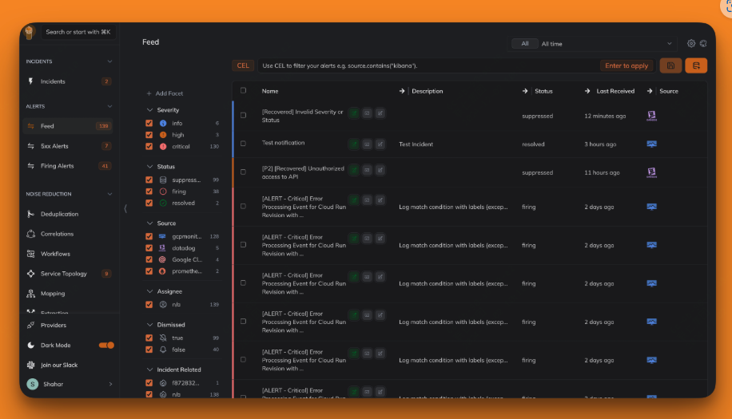
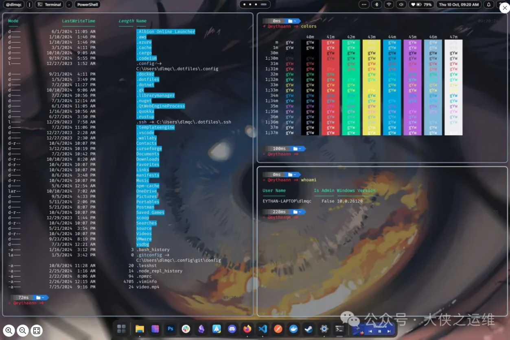
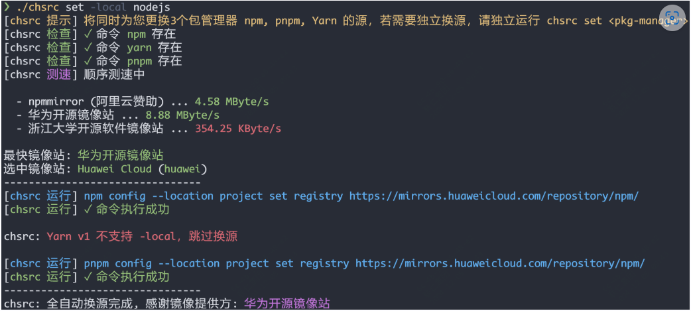
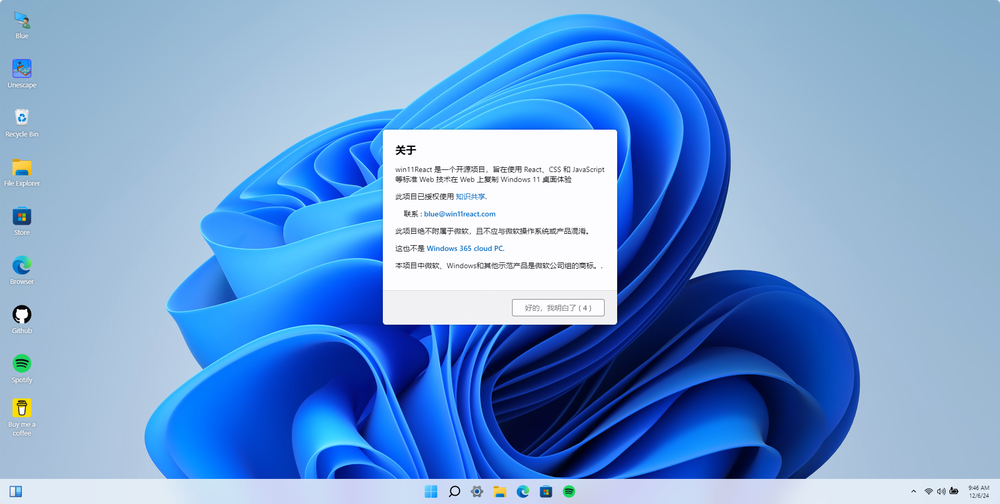

封面图是周末在咖啡店拍的，阳光很好，甚至有些晒，之前看过一条报告说上海市全球咖啡店最多的城市，而陆家嘴街道的咖啡店更是多达164家。

问题来了？看到本文的，平时咖啡喝的多吗？

<small>本周刊每周六早上发布，分享我在本周找到的优秀开源项目、读到的有趣书籍和独特的观点等内容。</small>

---

### 本周开源推荐

本周为大家精选了几款实用的开源项目。如果你是量化投资者，**InStock** 可以帮助你获取全面的股票数据并进行自动交易。对于运维团队，**Keep** 提供了一个高效的告警管理与 AIOps 平台，简化了告警处理流程。想要提升桌面体验的用户可以尝试 **Seelen UI**，它提供了高度可定制的桌面环境。开发者在更换软件源时，**chsrc** 是一个全平台通用的换源工具，支持快速切换多种源。若你在构建现代化桌面应用，**Win11React** 提供了丰富的 UI 组件库，方便开发。最后，**Pilipala** 是一款功能强大的 B 站第三方客户端，支持多种视频和直播功能，极大提升了用户体验。这些项目各具特色，能够在不同场景下提升开发效率和用户体验。

#### stock

**InStock** 是一个用 Python 开发的股票系统，专为量化投资者设计，旨在提供全面的股票数据获取、指标计算、形态识别和自动交易功能。该系统支持多种终端设备，包括 PC、平板和手机，方便用户随时随地进行股票分析和交易。InStock 内置多种技术指标计算功能，基于 Talib 和 Pandas 库，确保计算高效准确。用户可以利用系统提供的指标（如 MACD、KDJ、BOLL、RSI 等）来判断买入或卖出的时机。例如，当 KDJ 指标中的 K 值在 80 以上，D 值在 70 以上，J 值大于 90 时，表示超买，股价可能下跌，投资者应谨慎行事。

#### keep

**Keep** 是一个开源的告警管理与 AIOps 平台，旨在提供一个统一的界面来管理所有告警和事件。该平台通过告警的去重、丰富、过滤和关联，显著提升了告警处理的效率和准确性。Keep 支持与多种监控工具的双向集成，确保告警信息的实时更新和一致性。此外，用户可以通过声明式 YAML 文件定义自动化工作流，实现告警和事件管理的自动化。利用 AI 技术，Keep 能够进行告警的智能关联与总结，帮助用户快速理解和处理复杂的告警信息，适合运维和开发团队使用。

#### seelen ui

**Seelen UI** 是一个完全可定制的桌面环境，专为 Windows 10 和 11 设计，旨在提升用户的桌面体验和生产力。该项目提供了一个高度可定制的用户界面，允许用户根据个人喜好调整菜单、工具栏和小部件等元素，以创建最适合自己的工作空间。Seelen UI 集成了平铺窗口管理器，自动排列窗口以支持多任务处理，简化了工作流程。此外，内置的媒体模块与大多数音乐播放器兼容，用户可以轻松控制音乐播放而无需打开额外窗口。通过简单的命令行工具，用户可以快速访问应用程序和执行命令，进一步提升操作效率。Seelen UI 还支持多语言，确保全球用户都能享受个性化的桌面体验。

#### chsrc

**chsrc** 是一个全平台通用的换源工具与框架，旨在简化软件源的更换过程。作为开发者，常常需要手动更换 pip、npm、brew 等软件的源，这一过程效率低下。chsrc 通过支持 60 多种源的快速更换，极大地提升了这一过程的便利性。该工具使用 C 语言编写，确保了其简洁和高效。

chsrc 提供了多种安装方式，适用于 Windows、Linux 和 macOS 用户。用户可以通过简单的命令行操作快速安装和使用该工具。其核心功能包括自动测速以寻找最快的源、支持自定义源地址以及项目级换源，避免全局更改。通过 chsrc，开发者可以轻松管理和切换软件源，提升开发效率。

#### win11React

Win11React 是一个用 React 开发的 Windows 11 风格的 UI 组件库，它提供了丰富的组件，包括按钮、卡片、表格、表单等，可以用于构建现代化的桌面应用程序。

### pilipala

如果你是B站用户，那么一定要看下，这款用 Flutter开发的B站第三方客户端pilipala，安卓和苹果都支持。大部分功能都支持如推荐视频列表、热门直播、番剧、离线缓存、回复评论、弹幕和搜索等。

---

### 影视推荐

#### 豺狼的日子

改编自同名小说，除了女主槽点较大外，全剧很吸引人，虽然只更新到第八集，但是已经刷了2遍了。

>这个男人，绝对符合你对杀手的一切想象。 他代号豺狼，身材高大瘦削，穿衣显瘦脱衣有肉； 看上去人畜无害，带着大冰同款半永久苦笑，像个这辈子倒霉惯了的老实人。 还精通易容术。 这是化妆前： 这是化妆后： 只要豺狼愿意，可以改变嗓音和口音，变成任何人。 

