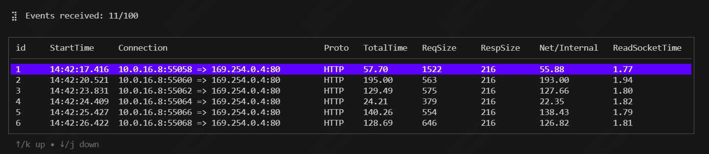
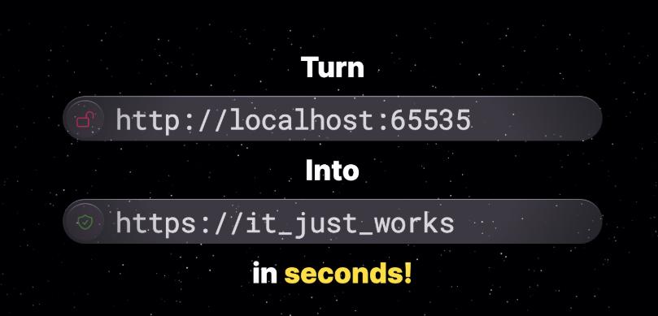
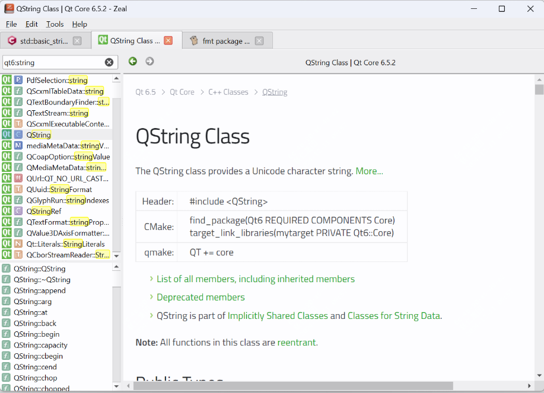
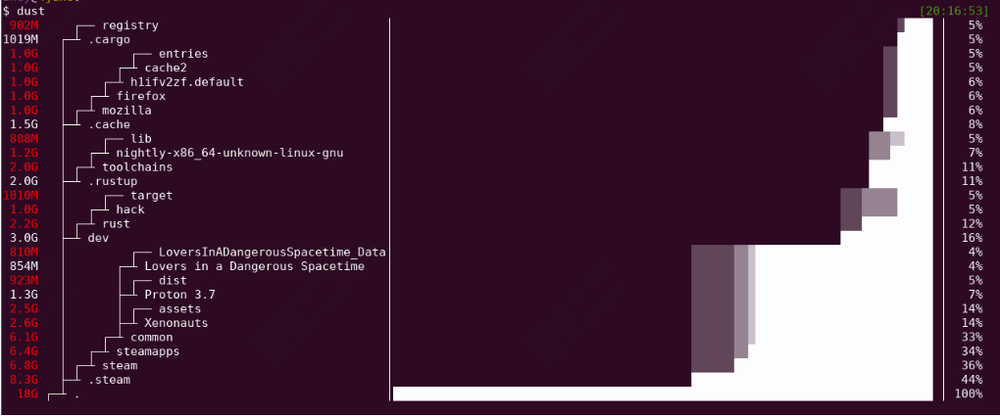
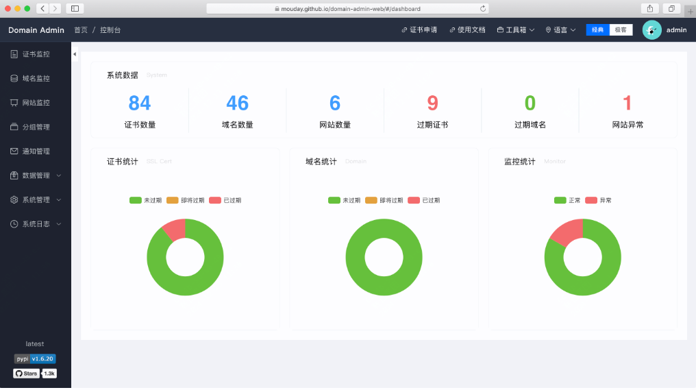

封面图是周中外出散步拍的，真的的霜叶红于二月花，而且可以看到上面真的是有霜的，以前这句诗只是停留在记忆里。

<small>本周刊每周六早上发布，分享我在本周找到的优秀开源项目、读到的有趣书籍和独特的观点等内容。</small>

---

### 本周开源推荐

本周为大家精选了几款实用的开源项目 这些项目各具特色，能够在不同场景下提升开发效率和用户体验。希望你能找到适合自己的工具！

#### github.com/guozhigq/pilipala

**Pilipala**：一款功能强大的 B 站第三方客户端，支持多种视频和直播功能，极大提升了用户体验。

#### github.com/hengyoush/kyanos

**Kyanos**是基于eBPF技术，能够捕获和分析网络请求，如HTTP、Redis和MySQL请求。

它帮助用户快速定位和解决网络异常问题，而无需复杂的抓包、下载和分析步骤。

#### github.com/cheeselemon/ophiuchi-desktop

**Ophiuchi Desktop**是一个本地 HTTPS 代理服务器管理工具，使用 Docker 作为后端。目标是简化 HTTPS 代理服务器的配置和管理，使开发者能够更方便地在本地环境中进行开发和测试。

#### github.com/zealdocs/zeal

**Zeal**：一个全平台通用的文档浏览工具，支持快速查阅多种文档。它的设计初衷是为开发者提供一个快速、便捷的文档查询工具，尤其是在没有网络连接的情况下。Zeal 支持多种编程语言和框架的文档，用户可以根据需要下载和管理这些文档集。

### github.com/bootandy/dust

**Dust**：一个高效的磁盘使用分析工具，帮助用户快速了解磁盘使用情况。Dust 是一个用 Rust 编写的更直观的 du 工具。它的设计初衷是为了让用户更轻松地查看磁盘空间的使用情况。Dust 的特点在于它能够智能地递归查找目录树中的大文件和子目录，并以直观的方式展示出来。

#### github.com/dromara/domain-admin

**domain-admin**：一个开源的域名及证书管理平台，帮助用户管理域名和证书。
 
---

本周没有看剧，也没有看书，只是在学习和焦虑中度过

学习主要原因是焦虑，而焦虑的最大原因是没有那么的忙，或者说在瞎忙

没那么忙就会想很多，想很多又会睡不着，睡不着精神不佳，陷入循环

太难了！

