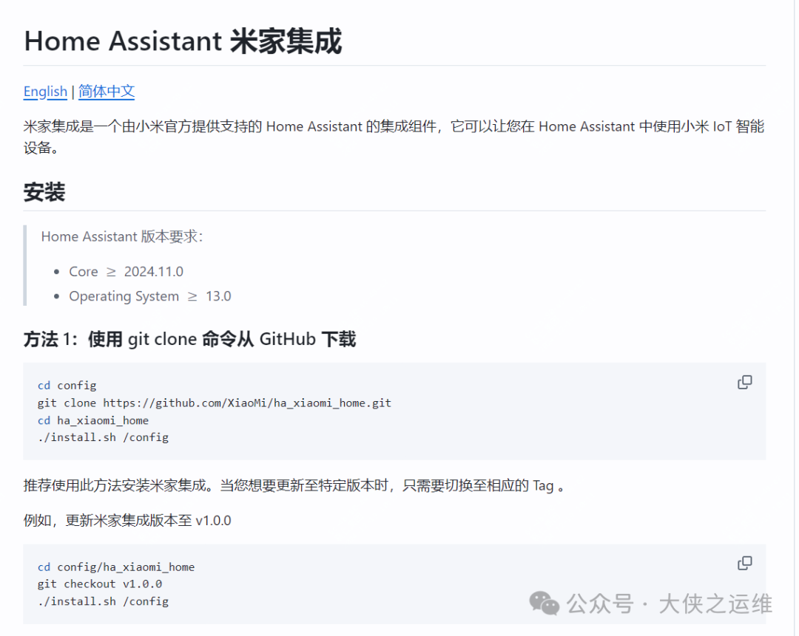
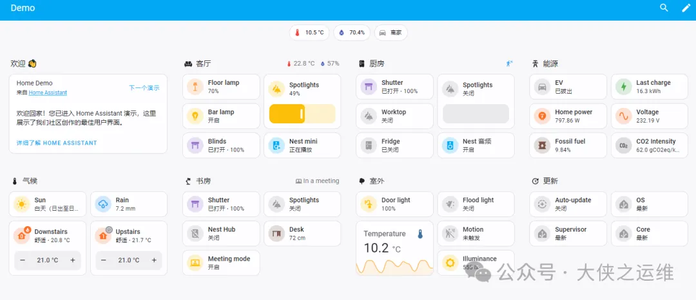
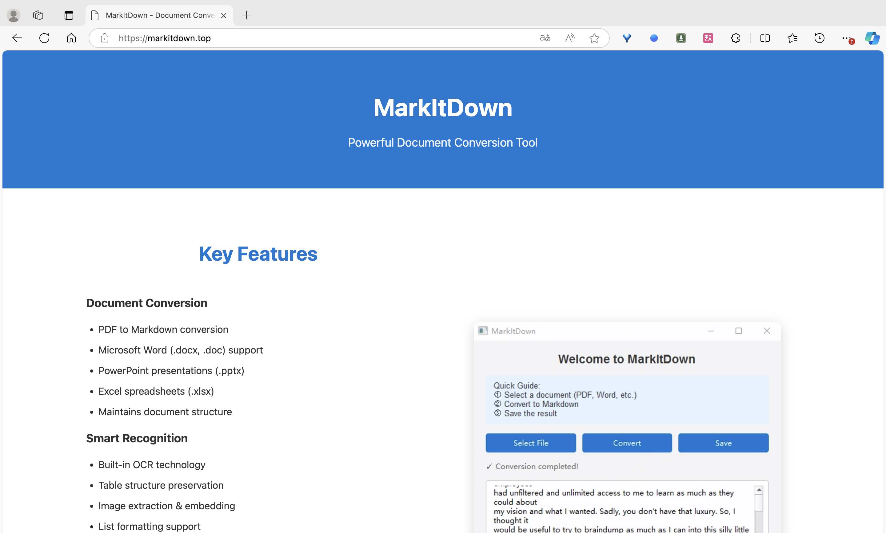
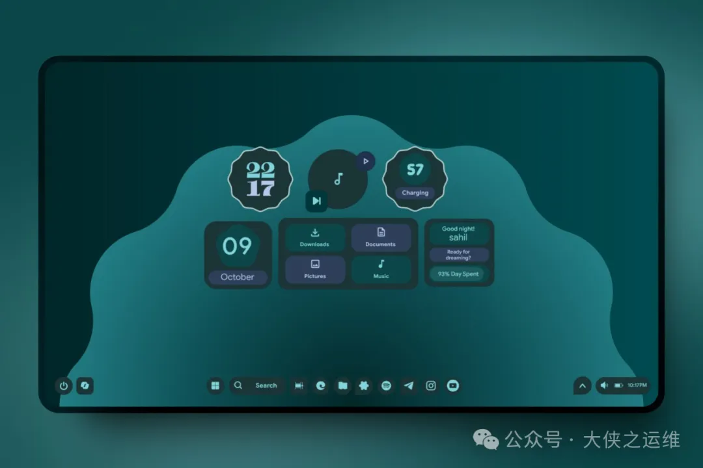
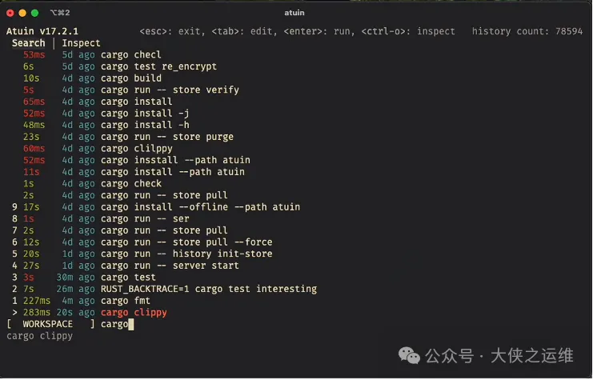

封面图是豆汁套餐，之前一直看评论说豆汁难喝，这次终于鼓起勇气尝试了，结果发现还不错，有点酸，但可以接受。

<small>本周刊每周六早上发布，分享我在本周找到的优秀开源项目、读到的有趣书籍和独特的观点等内容。</small>

---

### 本周开源推荐

本周为大家精选了几款实用的开源项目，这些项目各具特色，能够在不同场景下提升开发效率和用户体验。希望你能找到适合自己的工具！

#### github.com/XiaoMi/ha_xiaomi_home

本周最火的项目之一了，一天之内上涨7k star，目前更是到了1.3w star。

Xiaomi Home Integration for Home Assistant 是一个由小米官方支持的集成组件，旨在将小米IoT智能设备引入Home Assistant。该项目支持多种设备类型，包括但不限于灯光、传感器、开关和摄像头。

#### github.com/home-assistant/core

Home Assistant 是一个开源的家庭自动化平台，旨在将本地控制和隐私放在首位。由全球的爱好者和 DIY 爱好者社区支持，Home Assistant 适合在 Raspberry Pi 或本地服务器上运行。

#### github.com/microsoft/markitdown

markitdown是微软推出的用于将pdf、ppt、word等格式的文档直接转换为markdown格式的工具。

因为依赖于python环境，对于普通用户有些复杂，这个网站做了一个简单的的GUI，可以直接使用。

> 地址：markitdown.top

#### github.com/Runixe786/MD3-Windows

MD3-Windows是一个为Windows桌面设计的Rainmeter皮肤，旨在将Material You设计语言引入你的桌面环境。

### github.com/atuinsh/atuin

**Atuin **是一个旨在替代现有 shell 历史记录的项目，它将 shell 历史记录存储在 SQLite 数据库中，并记录命令的额外上下文。

#### github.com/dromara/domain-admin

**Domain Admin **是一个基于 Python 和 Vue3.js 技术栈实现的域名和 SSL 证书监测平台。它旨在解决不同业务域名 SSL 证书申请自不同平台，到期后无法及时收到通知，导致线上访问异常的问题。
 