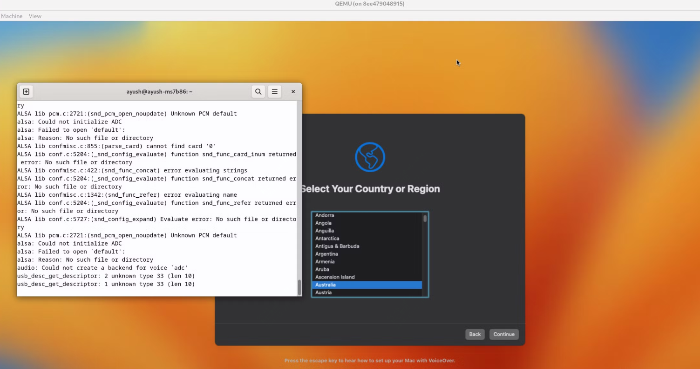
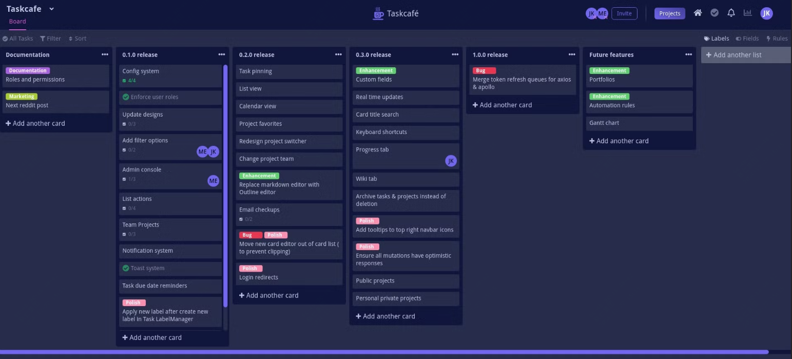
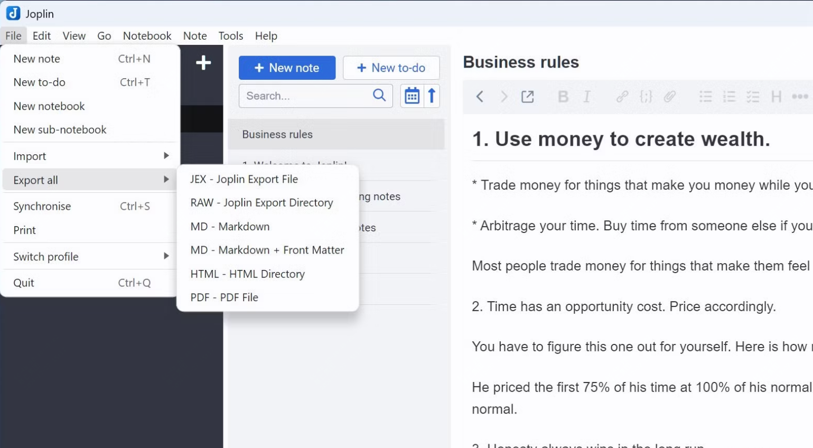
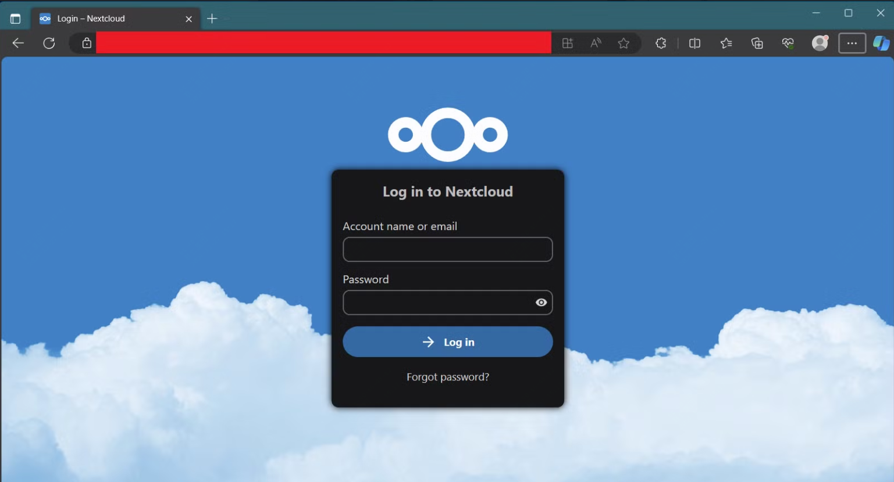
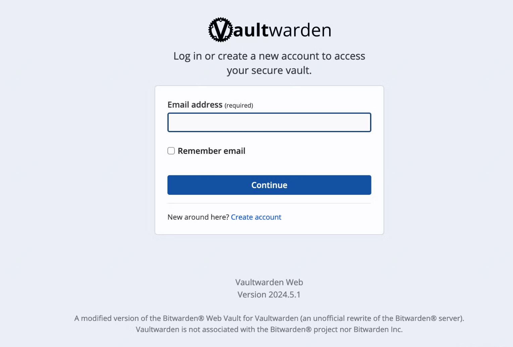
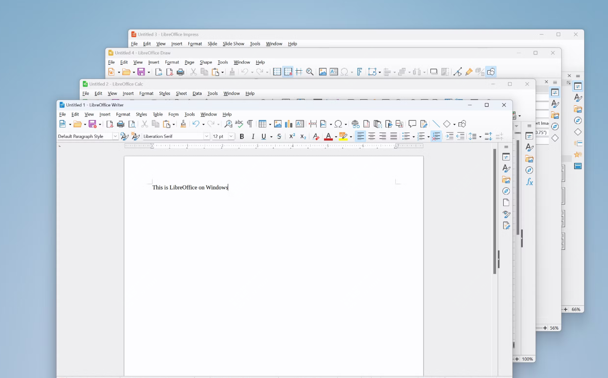

<small>10-开源周刊，推荐7款提高生产力docker容器</small>

在工作中，Docker 容器已经成为提高生产力的利器。以下是七款能够显著提升工作效率的 Docker 容器：

## 1. Watchtower



**Watchtower**：这款工具简化了 Docker 容器的更新过程。它会自动更新你的 Docker 容器，当有新版本可用时，Watchtower 会关闭现有容器并使用更新的镜像重新启动它。这种自动化更新机制不仅节省了时间，还确保了你始终运行最新和最安全的应用版本。

启动方式：
```
$ docker run -d \
    --name watchtower \
    -v /var/run/docker.sock:/var/run/docker.sock \
    containrrr/watchtower

```
## 2.Taskcafe



 **Taskcafe**：这是一个开源的项目和任务管理工具，类似于 Trello。你可以创建新项目，添加所需的列，并在其中插入任务，方便管理工作。Taskcafe 提供了一个清晰直观的界面，让你能够轻松掌控工作进度，分配任务并与同事协作。

 启动方式：

```
git clone https://github.com/JordanKnott/taskcafe && cd taskcafe
docker-compose -p taskcafe up -d
```

## 3.Joplin 



 **Joplin**：这是一款免费的开源笔记解决方案，可以轻松部署为 Docker 容器。Joplin 支持 Markdown 语言，可以添加标签、附件和待办事项，灵活性很高。你可以使用 Joplin 创建个人知识管理系统，并通过多种同步选项（如 OneDrive、Google Drive 或 Dropbox）保持数据的一致性。

 ```
 docker run --env-file .env -p 22300:22300 joplin/server:latest
 ```

## 4. Nextcloud


 
 **Nextcloud**：这款工具类似于 Google Drive、OneDrive 或 Dropbox，但它提供了个人云存储解决方案。你可以决定文件存储位置和访问权限，并使用集成的文档编辑、在线日历、任务管理和视频会议工具。Nextcloud 还支持多种扩展，允许你根据需求自定义云体验。

 ```
 $ docker run -d -p 8080:80 nextcloud
 ```

## 5. Focalboard


 **Focalboard**：这是一个开源的项目管理工具，类似于 Trello、Notion 和 Asana。Focalboard 提供多种视图来组织工作，如看板、表格和日历，并支持自定义界面。无论是管理个人待办事项、小型项目还是大型客户项目，Focalboard 的灵活性都能满足你的需求。

## 6. Vaultwarden



 **Vaultwarden**：这是一个轻量级的开源密码管理工具，类似于 Bitwarden。它提供强大的加密功能来保护你的数据，并支持跨平台使用。Vaultwarden 还支持自动填充登录信息和生成长且唯一的密码，确保你的密码始终安全可用。

## 7. LibreOffice



7. **LibreOffice**：这是一个 Microsoft Office 的替代品，可以作为 Docker 容器部署。它提供了所有必需的工具，如文字处理软件、PPT 解决方案和电子表格工具。LibreOffice 兼容 Microsoft Office 文件，功能丰富，能够满足日常办公需求。

这些 Docker 容器不仅能帮助你提高工作效率，还能简化开发环境，优化工作流程。根据自己的需求选择合适的容器，创建一个高效的工作空间吧。
=======