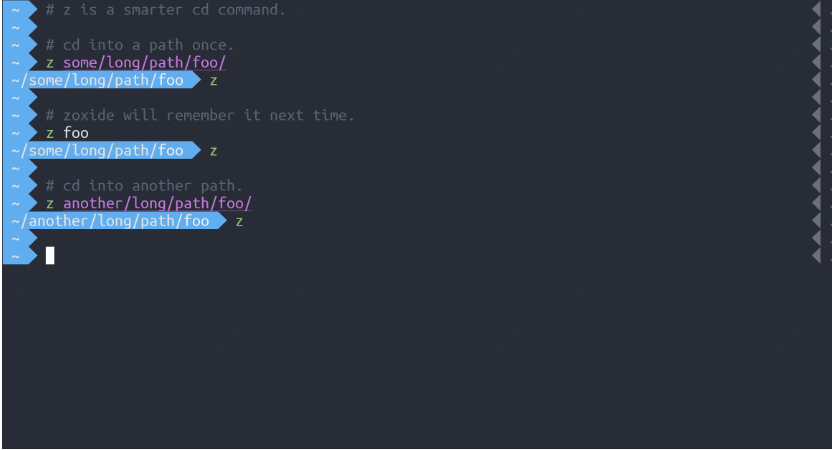

<small>12-开源周刊，本周发现的不错的开源工具</small>

# 本周开源工具推荐

## 一个可以调试python代码的工具

**地址:github.com/gaogaotiantian/viztracer**

如果是python开发者，或者在维护python相关的项目，那么这个工具可以帮你快速定位问题。

VizTracer 是一个用于 Python 的调试和性能分析工具，它通过记录函数调用和返回的详细信息，生成可视化的时间线，帮助开发者快速定位和优化代码中的性能瓶颈。

## 更加智能的cd命令

**地址：github.com/ajeetdsouza/zoxide**

首先它是使用人rust写的，所以性能上还是不错的。而它的介绍当中，提到最多的是它的智能，它可以根据用户的习惯去记忆一些目录，这样你可以快速跳转你需要的目录。该工具是跨平台可用的，支持linux、macos、windows。

 

## mac用户的markdown编辑器新选择

**地址：github.com/MarkEdit-app/MarkEdit**

MarkEdit 是一个专为 macOS 设计的免费开源 Markdown 编辑器。它的灵感来源于 Mac 上的 TextEdit，但专注于 Markdown。MarkEdit 以其简洁直观的界面和强大的功能，迅速成为用户的首选工具。

  

## 所见即所得的pdf转为markdown

**地址：github.com/getomni-ai/zerox**

与常规的文档转换工具不同，zerox 是一个更加智能的文档转换工具，它是采用视觉模型来实现的pdf到markdown的转换。

说个例子，就算你是手写体，也能精准的识别出来。

## 一款集速度、功能和原生 UI 于一体的终端仿真器

**地址：github.com/ghostty-org/ghostty**

Ghostty 是一款集速度、功能和原生 UI 于一体的终端仿真器，旨在提供最佳的用户体验。它不仅在性能上具有竞争力，还提供了丰富的功能和灵活的自定义选项。

## 一款强大的图表生成工具

**地址：github.com/mermaid-js/mermaid**

Mermaid 是一个强大的图表生成工具，它可以将文本描述转换为各种图表，包括流程图、时序图、UML 图等。Mermaid 以其简洁的语法和强大的功能，迅速成为开发者中流行的选择。

# 随便聊几句

最近在看《大奉打更人》，小说看过两遍，电视剧个人感觉目前来看还原度不错，尤其是一些细节。关键是很搞笑，牛马太苦了，所以周末需要一些搞笑的剧或者综艺来麻痹下。

2025年到了，翻了下2024年的元旦，仿佛就在昨天一样，这是本年的第一篇周报，后面计划周报好好搞起来。

周报会同步发布在：[weekly](weekly.herotops.xyz/),欢迎围观。

前面说了剧集，再来聊聊书，感觉今年看的印象最深的是《控糖革命》，前几天发现，很多大佬的书单里面也有这本书，如果你有减肥的打算，可以去看下，从原理层面了解下。

前几天在年底做了体检，体重相较于去年同期降了30斤，虽然距离终极目标还差10斤，但发现减不动了，在一个体重范围内徘徊很久，后面计划加个量，有氧与无氧同步进行。

