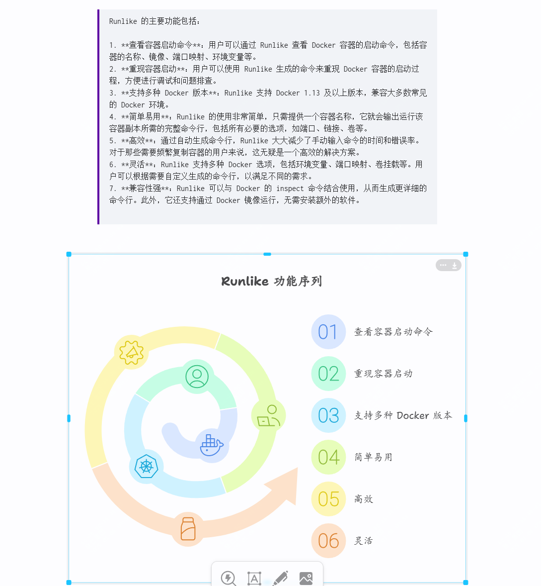
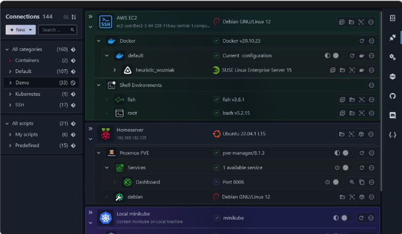
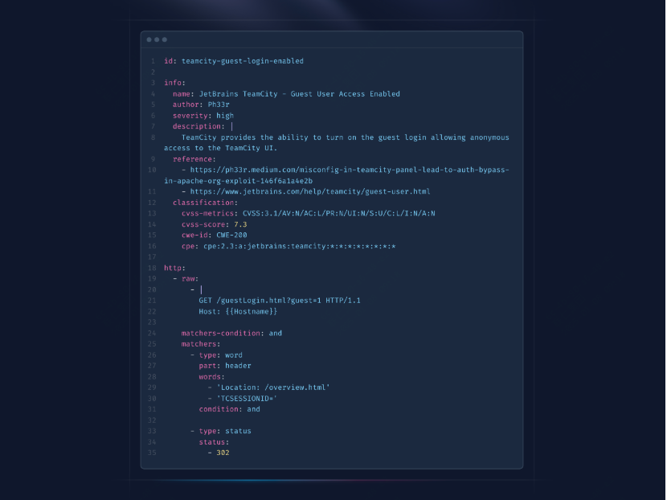
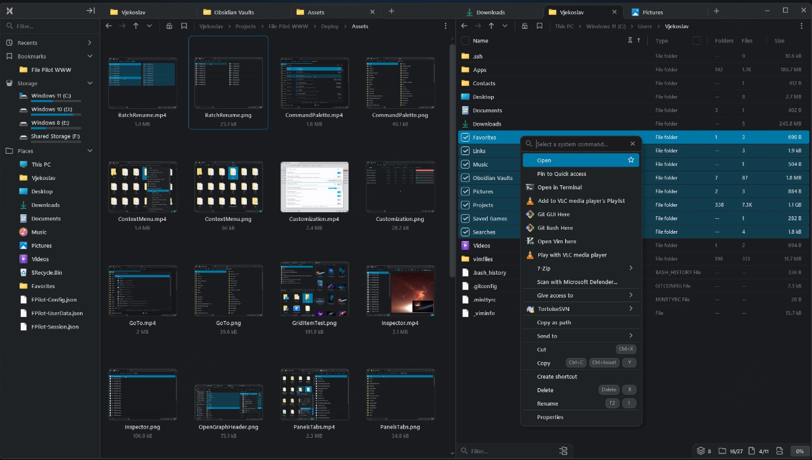
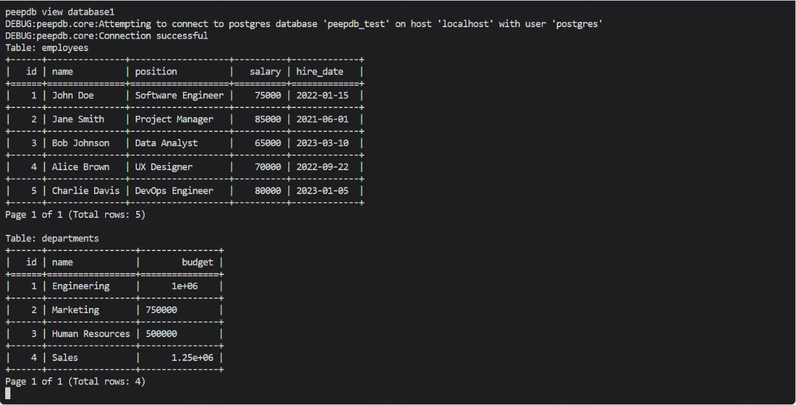
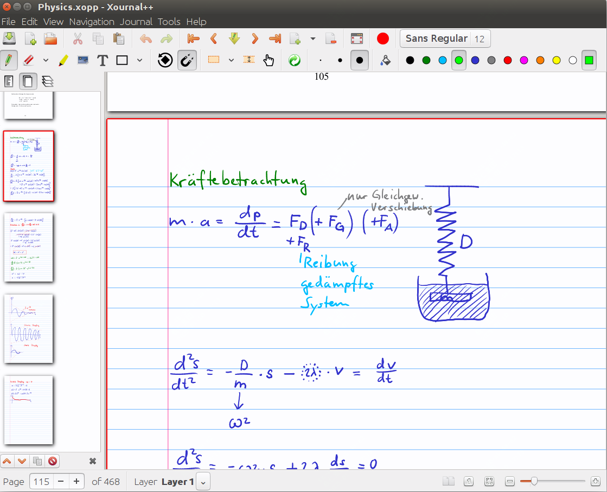

<small>13-开源周刊，本周发现的不错的开源工具</small>

# 本周开源工具推荐

## 一款超强的AI绘图工具

**地址:www.napkin.ai**

napkin.ai 是一个强大的 AI 绘图工具，它可以将文本内容转化为直观的视觉效果。用户只需将文本粘贴到输入框中，点击生成按钮，即可快速生成高质量的视觉效果。

## 更加智能的shell连接中心和远程文件管理器

**地址：github.com/xpipe-io/xpipe**

XPipe 是一个创新的 shell 连接中心和远程文件管理器，旨在让你从本地机器访问整个服务器基础设施。它基于已安装的命令行程序运行，无需在远程系统上进行任何设置。

 

## 开源安全漏洞扫描神器

**地址：github.com/projectdiscovery/nuclei**

Nuclei 是一个开源的快速模板驱动的扫描工具，由 ProjectDiscovery 团队开发，旨在帮助安全研究人员、渗透测试人员和开发人员快速、有效地识别和报告安全漏洞。

  

## 下一代文件管理器

**地址：github.com/getomni-ai/zerox**

File Pilot 是一款全新的文件资源管理器，它以其卓越的性能和丰富的功能，迅速成为用户的首选。

## 简洁的数据库管理工具

**地址：github.com/PeepDB-dev/peepdb**

PeepDB 是一个简洁的数据库管理工具，它可以帮助你轻松地管理和访问数据库。

## 开源笔记神器

**地址：github.com/xournalpp/xournalpp**

Xournal++ 是一款功能强大且灵活的手写笔记软件，适用于各种操作系统。无论是用于课堂笔记、会议记录，还是个人笔记，Xournal++ 都能提供出色的用户体验。

# 随便聊几句

周报会同步发布在：[weekly](weekly.herotops.xyz/),欢迎围观。

更全的合集可以到 herops.site 去查看

最近看了一本介绍衡阳保卫战的书《四十七天：援军明天到达》，衡阳保卫战是抗日战争中的一次重要战役，发生在1944年，是在湖南衡阳进行的抵抗日军进攻的战斗。

这场战役持续了47天，是抗日战争中持续时间最长的城市保卫战之一。

以1.7万人的兵力，抵抗了日军10万人的进攻。

从侧面了解了四次长沙会战，了解了方先觉壕沟等等，对这段历史感兴趣的可以去看下。

