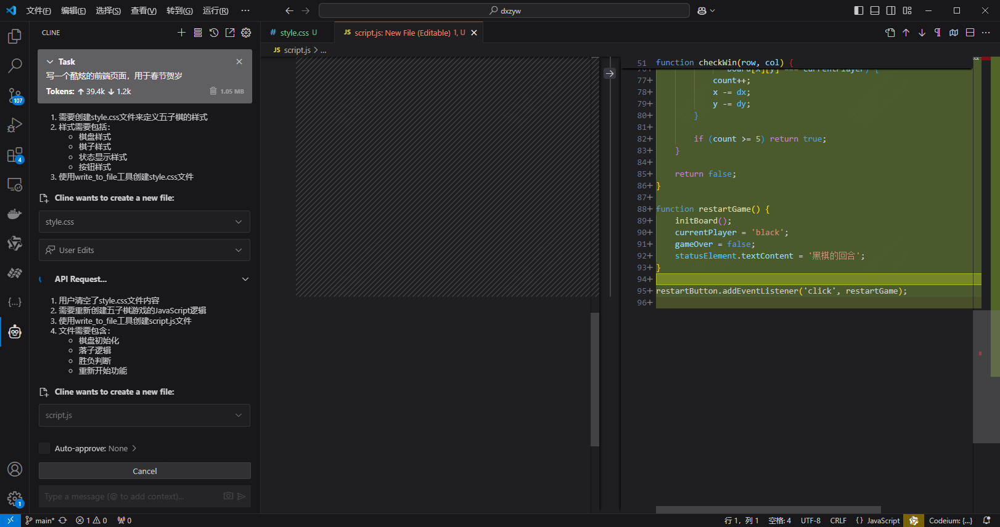
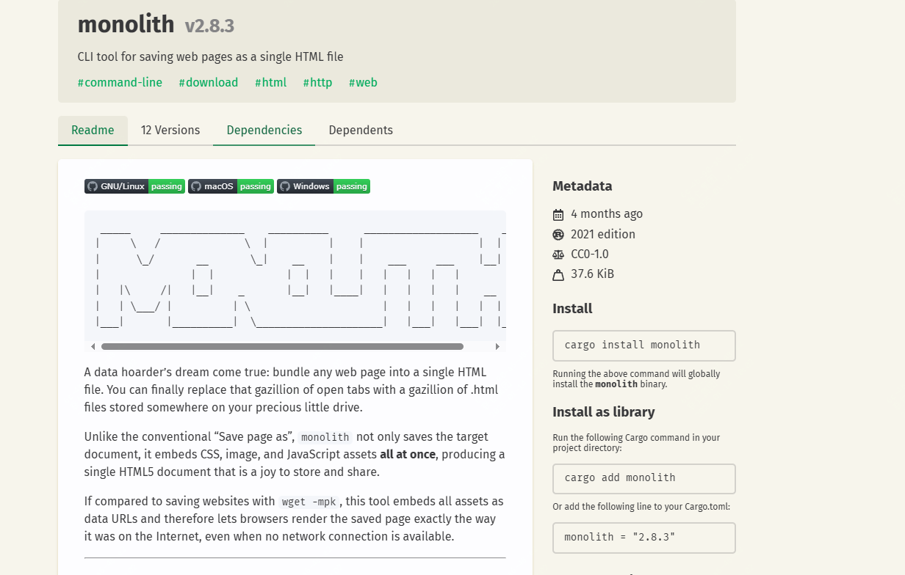
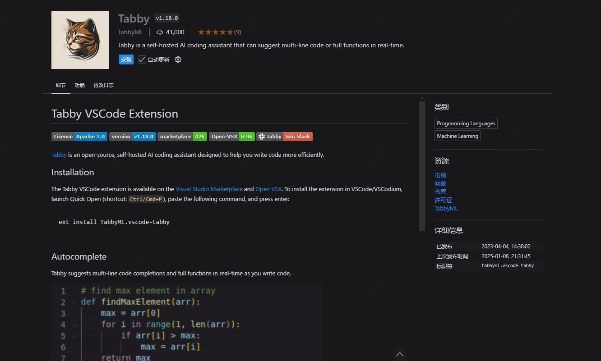
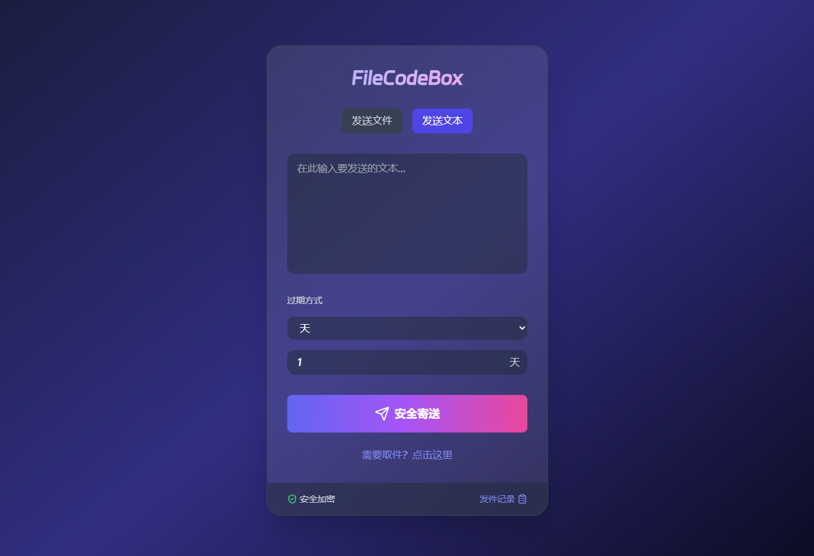
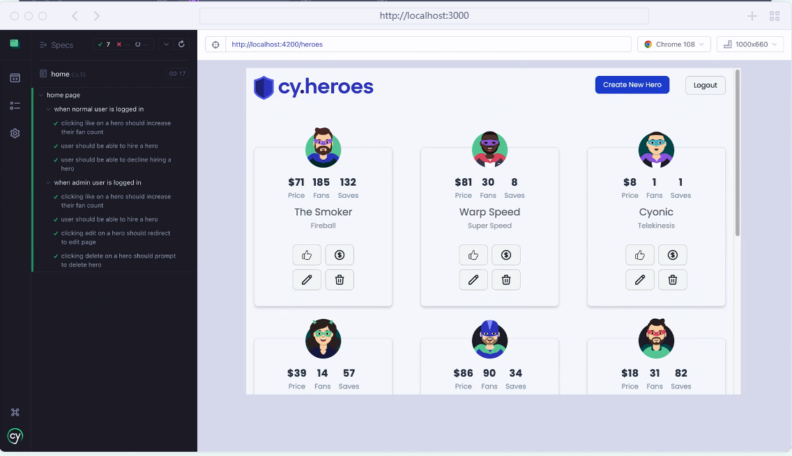

<small>14-开源周刊，本周发现的不错的开源工具</small>

春节气息渐浓，又到了回到那个熟悉的地方的时候!

每到这个时候，微信会发一些红包封面，公众号没有收到，不过别的号有收到，所以最近会发出来，然后视频号给了3000个，也会发出来。

同名视频号，可以先去围观下！

本周公众号发了创作记录，2024年创作了364天，断更了2天，我记得只有一天来着！

内容被看过116万次，相较去年降低，但是来源占比公众号消息占据了一半，所以还是要感谢各位的捧场。

# 本周开源工具推荐

## 打造自己的AI编程助手

**地址:github.com/cline/cline**

cursor最近很火，但是价格昂贵，cline提供了一个更廉价，更智能的选择。

Cline是一个集成在IDE中的自主编码助手，能够创建和编辑文件、执行命令、使用浏览器等功能，并在每一步都需要你的许可。Cline利用大模型的代理编码能力，能够逐步处理复杂的软件开发任务。通过工具，Cline可以创建和编辑文件、探索大型项目、使用浏览器和执行终端命令，为你提供超越代码补全或技术支持的帮助。

## 一条命令行打包一个网页为html 文件

**地址：github.com/Y2Z/monolith**

Monolith 是一个命令行工具，可以将完整的网页保存为单个 HTML 文件。这个工具不仅保存目标文档，还嵌入了 CSS、图像和 JavaScript 资源，生成一个单一的 HTML5 文档。

与传统的“另存为”功能不同，Monolith 能够将所有资源嵌入为数据 URL，从而使浏览器在没有网络连接的情况下也能准确渲染保存的页面。

 

## 自部署的AI编程助手，堪称效率神器

**地址：github.com/TabbyML/tabby**

Tabby 是一个自托管的 AI 编码助手，提供了一个开源且本地部署的替代方案，旨在与 GitHub Copilot 竞争。Tabby 的设计初衷是为开发者提供一个无需依赖外部数据库管理系统或云服务的解决方案。它的开放 API 接口使其易于与现有基础设施集成，例如云端 IDE。此外，Tabby 还支持消费级 GPU，使其在硬件要求上更加亲民。

## 文件快递柜？像拿快递一样取文件

**地址：github.com/vastsa/FileCodeBox**

FileCodeBox 是一个创新的文件快递柜项目，旨在提供匿名口令分享文本和文件的解决方案。这个项目的核心理念是让用户像拿快递一样方便地取文件。FileCodeBox 基于 Fastapi、Sqlite3、Vue3 和 ElementUI 构建，具有轻量简洁的特点。

  

## 让 AI 给你写 UI 自动化测试，更愉悦的 UI 自动化体验

**地址：github.com/web-infra-dev/midscene**

Midscene.js 提供了一种全新的自动化体验。通过自然语言交互，用户可以描述所需的操作步骤，Midscene.js 会自动规划并控制用户界面。它能够理解用户界面，并以 JSON 格式返回预期的响应。

## 这应该是24年最火的javascript开源项目

**地址：github.com/cypress-io/cypress**

Cypress 是一个现代化的前端测试工具，专为现代 Web 应用程序设计。它提供了快速、简单且可靠的测试解决方案，能够在浏览器中运行任何内容。Cypress 的目标是解决开发团队在测试现代应用程序和维护测试套件时面临的关键问题。

# 随便聊几句

周报会同步发布在：[weekly](weekly.herotops.xyz/),欢迎围观。

更全的合集可以到 www.herops.site 去查看

《鱿鱼游戏》第二季已经上线，并且已经完结

真是的一言难尽，感觉像是刚开了个头，就结束了。

第二季前面铺排的真的太长了。

