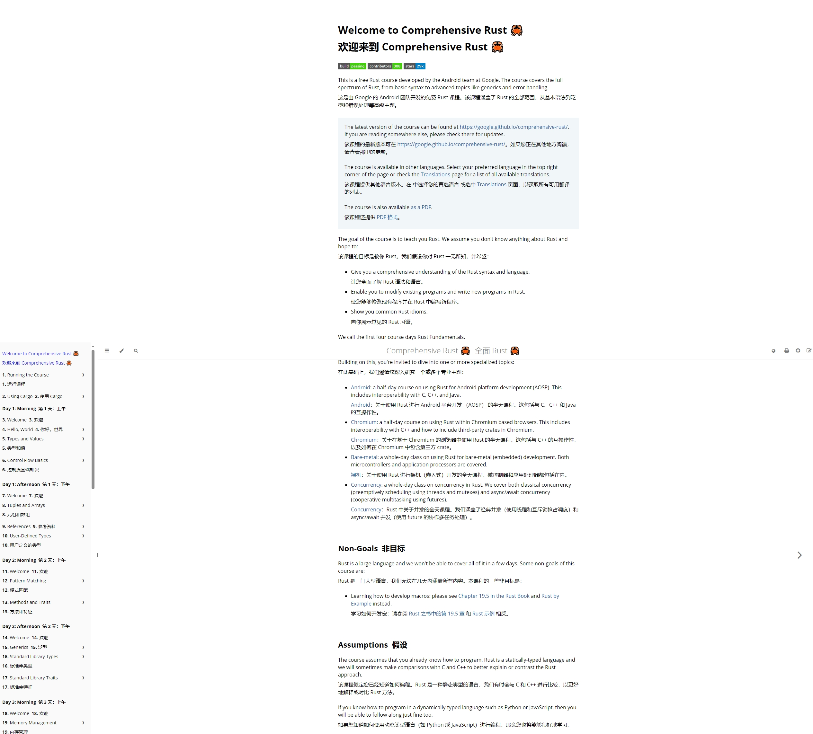
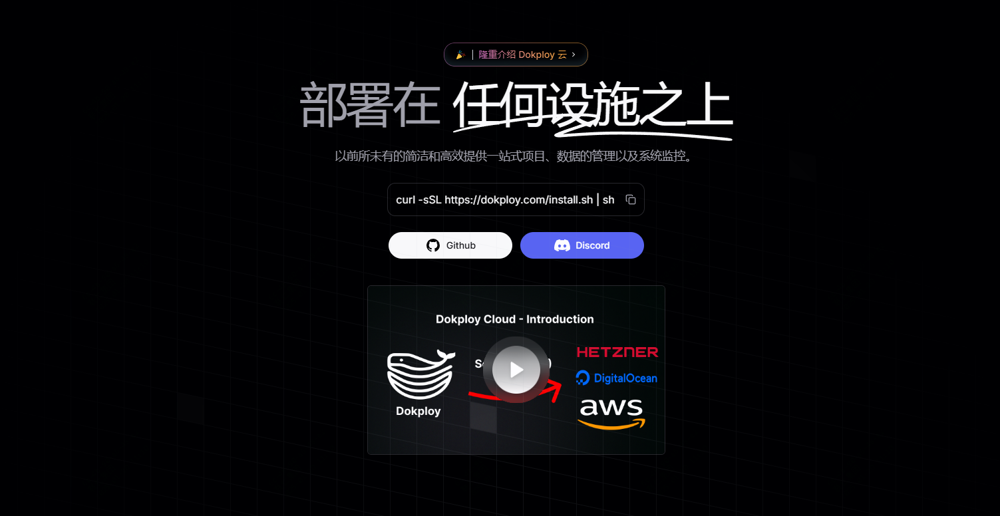
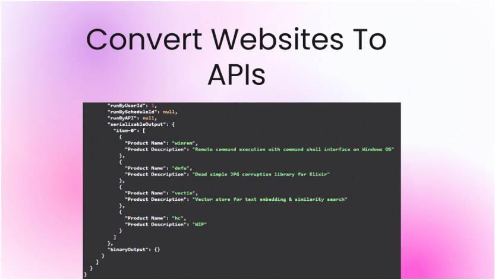
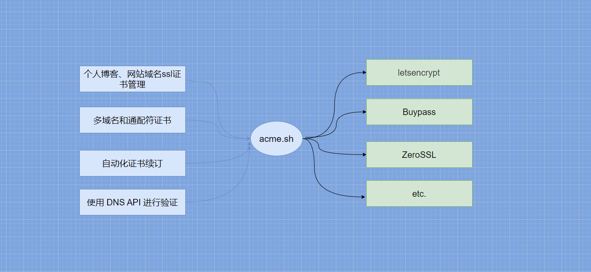
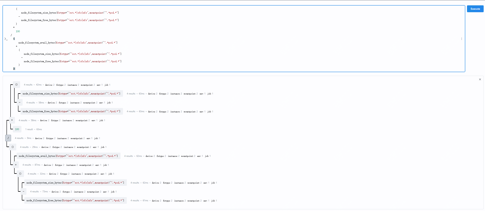
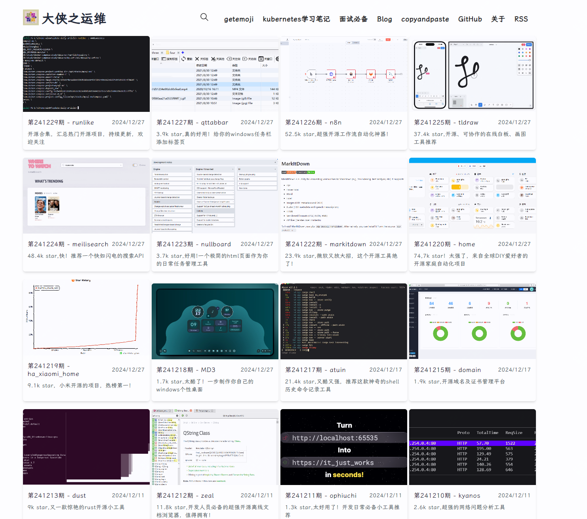

<small>15-开源周刊，本周发现的不错的开源工具</small>

看到这篇文章的时候，已经在回家路上了，9个半小时的高铁

各位明天上班嘛？（封面图是租房换上了春联）

还是已经在家了！

热乎的本周不错的开源工具合集来了

# 本周开源工具推荐

## 谷歌开源的rust学习手册

基础内容提供了4天的学习计划，然后就可以选择自己喜欢的方向继续学习，适合有一点基础，然后对rust感兴趣的朋友。

rust语言因为其内存使用安全，性能高，所以最近出现了蛮多用rust改写的小工具。

感兴趣的可以去看下这个教程。

**地址:github.com/google/comprehensive-rust**

## 更高级的服务器管理面板

**地址：github.com/Dokploy/dokploy**

如果你使用过宝塔一类的软件，那么这款替代开源工具值得一试。

Dokploy 是一个免费且可自托管的 PaaS 平台，Dokploy支持多节点、实时监控、 支持各类数据库的定时备份

它提供了命令行界面（CLI）和 API 访问，开发人员可以通过命令行或 API 管理应用程序和数据库。

 

## 不需要写代码，快速提取网页内容为表格

**地址：github.com/getmaxun/maxun**

Maxun 是一个开源的无代码网页数据提取平台，它可以将网页数据快速提取为电子表格或者json格式的内容

网页数据提取变得前所未有的简单和高效

## ssl证书替换神器

**地址：gitee.com/neilpang/acme.sh**

ssl证书对于网站的正常访问非常重要

但是免费证书3个月一换，付费的又价格高昂

acme.sh就是为了解决上述问题的，它可以帮助你自动化的完成证书的申请及替换

不仅支持单域名，泛域名证书也支持快速申请及替换

  

## promtheus3.0，带来监控新体验

**地址：github.com/prometheus/prometheus**

prometheus3.0版本最大的变化就是新的web UI设计，提供了蛮多不错的新功能，如监控指标查看，包括元数据的预览，还可以将你的查询语句格式化，分析语句的子查询等等

性能上也做了提升

更多具体的升级，可以到详细文章去浏览。

## 分分钟开发一个后端项目，一周内上线支撑百万用户的项目

**地址：github.com/supabase/supabase**

Supabase 是一个开源平台，提供全套的后端服务，包括 Postgres 数据库、实时功能、身份验证、存储和边缘函数，帮助开发者快速构建和扩展应用。

# 随便聊几句

周报会同步发布在 weekly.herotops.xyz 欢迎围观。

更全的合集可以到 www.herops.site 去查看

最近在看汉武大帝

汉武帝在位50年，40多年在和匈奴作战

出身卑微的卫青获得了对匈奴战争的首胜

霍去病封狼居胥、饮马瀚海的壮举，也为他英年早逝而叹息

但他的胞弟霍光又为汉朝带来了昭宣中兴

