<small>17-开源周刊，本周发现的不错的开源工具</small>

第17期开源周刊，24年中国72%的程序员认为求职具有挑战性，全球最高

最近看了jetbrains的2024年开发者生态系统现状报告，有些数据还是蛮有意思的

虽然样本只有2万多份，但在一定程度上也说明了一些问题

封面图是各个地区或国家对于24年从事科技类工作求职的难易程度

中国是72%，全球最高，只有13%认为顺利，你怎么看？

上述报告原文：**www.jetbrains.com/zh-cn/lp/devecosystem-2024/**

# 本周开源工具推荐

## 01微软开源，屏幕内容解析器

**star：14.9k fork：1.1k**

OmniParser是一个可以将屏幕上的图片或者桌面内容解析为结构化数据的方法，由微软开源，目前已经更新到V2版本

最初的v1版本是24年发布的，目前在huggingface上可以体验。

**地址:github.com/microsoft/OmniParser**

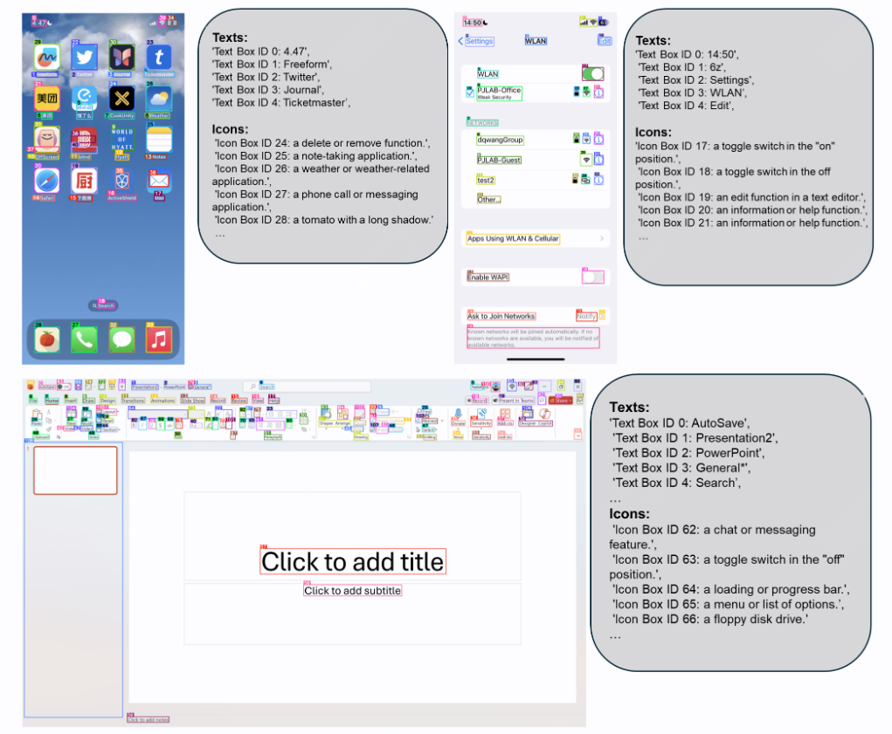

## 02企业内部开源Wiki或者文档管理工具

**star：9.6k**

docmost是一个专注用于企业内部文档管理的工具

它支持权限管控，可以为不同的部门或者组织分配空间，支持协同编辑、评论功能、搜索功能

支持附件上传，可使用本地存储或者对象存储

界面类似与notion，也可作为notion的替代品

**地址：github.com/docmost/docmost**

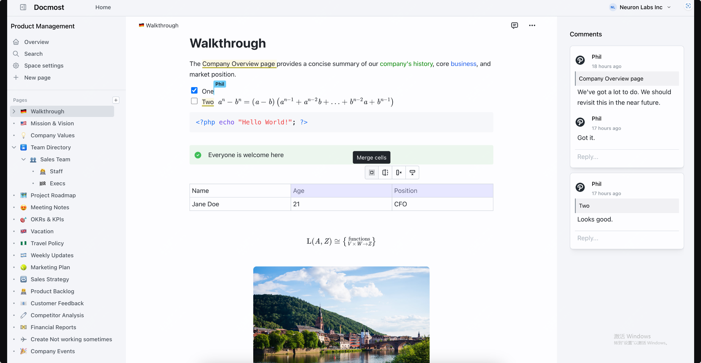

## 03AI大模型一键生成视频

**star：23.3k fork：3.4k**

MoneyPrinterTurbo是一个基于大模型的视频生成工具，你只需提供一个视频 主题 或 关键词 

就可以全自动生成视频文案、视频素材、视频字幕、视频背景音乐，然后合成一个高清的短视频

**地址：github.com/harry0703/MoneyPrinterTurbo**

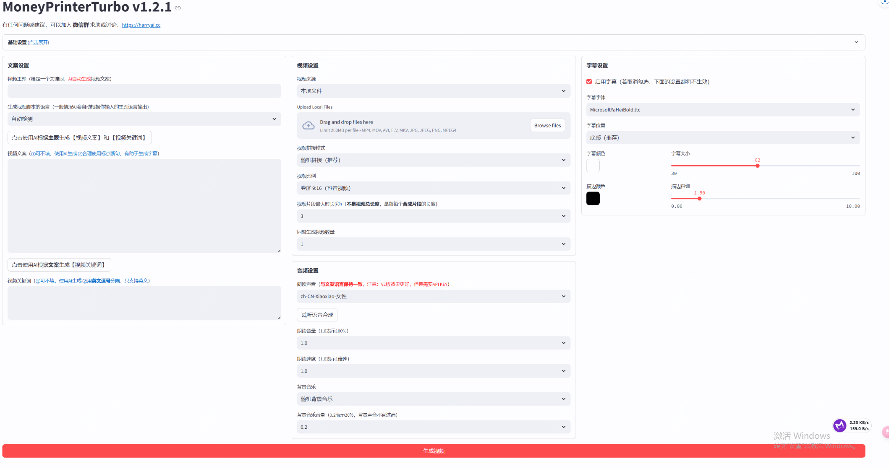

## 04go语言的CLI框架

**star：39.3k fork：2.9k**

cobra是一个用于创建和管理Go语言项目的命令行工具

支持子命令嵌套、全局/局部 Flags 管理以及 POSIX 命令行兼容性。

它提供自动生成帮助文档、智能错误命令建议、Bash 自动补全和 Man 手册生成等功能，简化了 CLI 开发流程。

此外，Cobra 可通过 `cobra create` 生成应用框架，并与 Viper 库集成实现配置管理。

**地址：github.com/spf13/cobra**

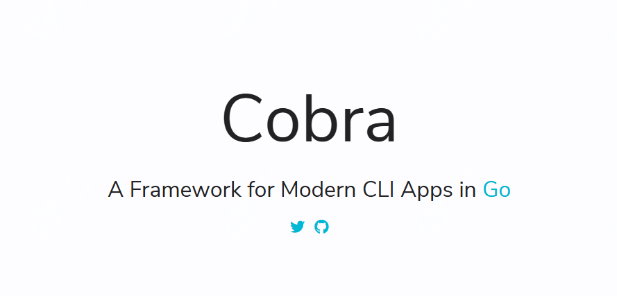

## 05成为CTO的必经之路

**star：30k fork：1.8k**
Awesome-cto 是一个为初创公司首席技术官（CTO）精选的资源列表，涵盖技术领导力、团队管理及行业趋势等内容，强调实用性和针对性。

该项目整合了技术文章、演讲、工具及实践指南等资源，覆盖云计算、大数据等热门领域，帮助CTO提升技能并优化决策。

此外，它通过开源协作持续更新资源，支持技术领导者构建高效团队并应对复杂技术挑战。

**地址：github.com/kuchin/awesome-cto**

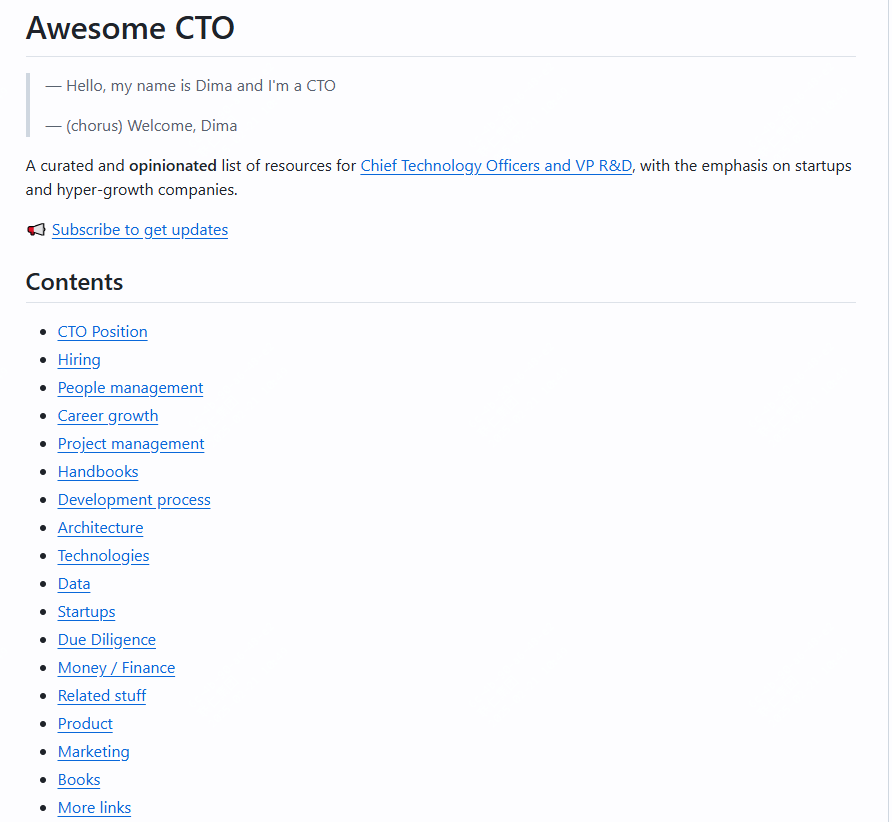

## 06从0开始训练小参数GPT

**star：10.9k fork：1.2k**

该项目可以作为初学者的入门项目，从0开始训练小参数的GPT模型

需要很小的资源配置，费时很短，可以作为入门项目

可以理解为是一个小型的LLM教程

**地址：github.com/jingyaogong/minimind**

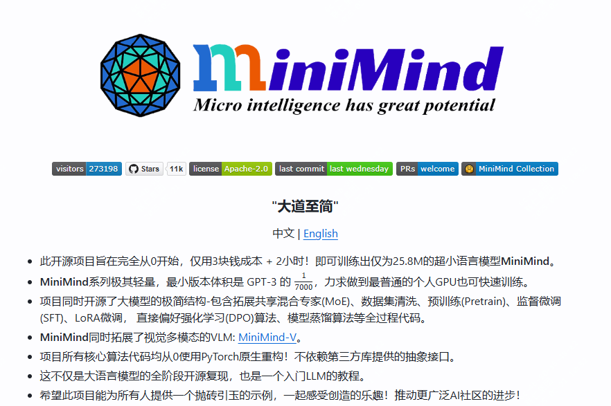

## 07开源的1000+图标库

**star：14.9k fork：600**

lucide是一个开源的1000+图标库，支持SVG、React、Vue、Svelte、Solid、Angular、CSS、Figma等多种格式

支持按颜色、形状、类别等筛选图标，支持按名称搜索图标

**地址：github.com/lucide-icons/lucide**

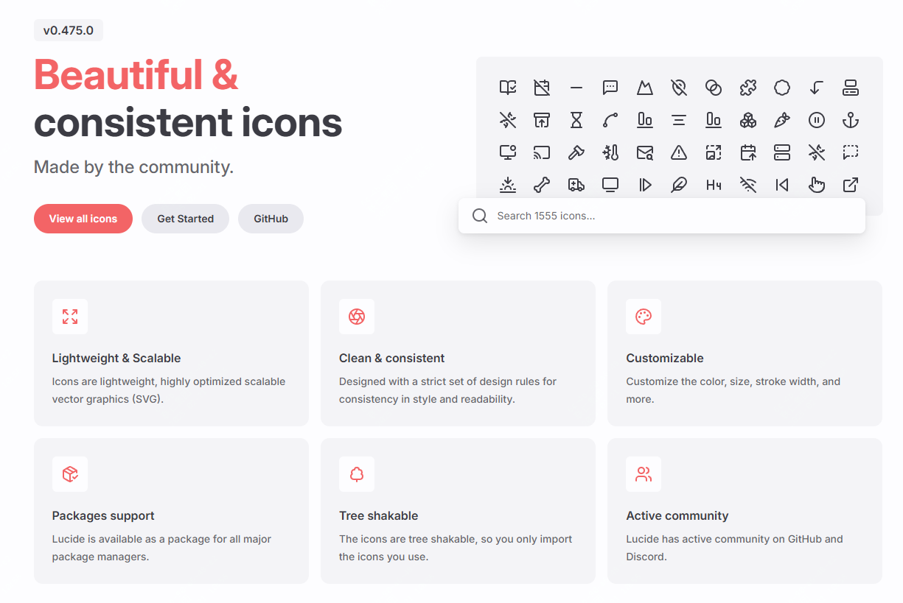

## 08从头开始构建、编码一个你了解的技术，如redis

**star：338k fork：31.2k**

Build-your-own-x 是一个通过从头重建流行技术（如数据库、操作系统、编程语言等）来帮助开发者深入掌握编程核心原理的开源项目。

它提供分步骤教程和代码示例（如构建Redis服务器、Shell工具等），涵盖网络通信、系统设计等实践场景。

项目整合了丰富的技术实现案例与最佳实践，支持开发者通过动手编码强化对底层技术的理解。

**地址：github.com/codecrafters-io/build-your-own-x**

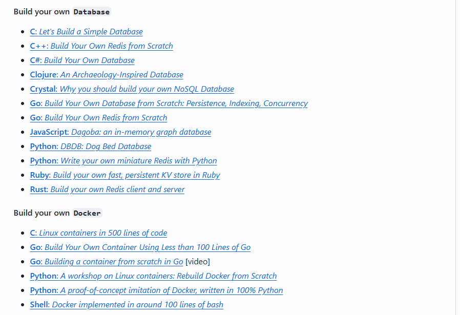

## 09用你闲置的设备运行AI集群

**star：24.2k fork：1.4k**

Exo 是一个开源项目，旨在通过整合日常设备（如手机、平板、电脑等）构建分布式 AI 集群，支持运行 LLaMA、Mistral 等大模型，无需依赖昂贵硬件即可实现复杂 AI 推理。

其核心技术包括动态模型分区（根据设备资源自动优化模型拆分）、P2P 设备平等架构（无主从结构）和自动设备发现功能，支持环形内存加权分区策略以高效利用异构设备算力。

用户仅需通过 Python 环境安装并运行 exo，即可在本地启动与 ChatGPT 兼容的 API 端点，低成本实现大模型部署。

**地址：github.com/exo-explore/exo**

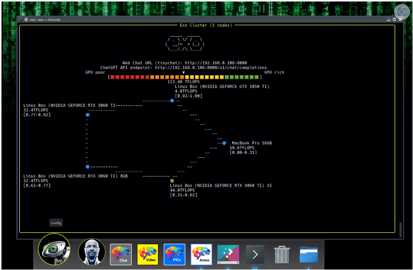

## 10 微信机器人项目

**star：6.6k fork：876**

这是一个基于AI + wechaty 的微信机器人

可以用来帮助你自动回复微信消息，或者管理微信群/好友.

目前支持deepseek、chatgpt、科大讯飞、kimi等接入

**地址：github.com/wangrongding/wechat-bot**

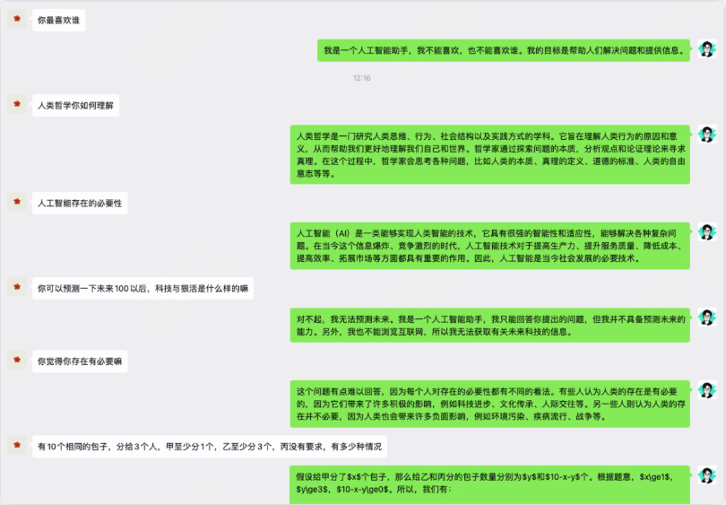

# 随便聊几句

周报会同步发布在 weekly.herotops.xyz 欢迎围观。

更全的合集可以到 www.herops.site 去查看

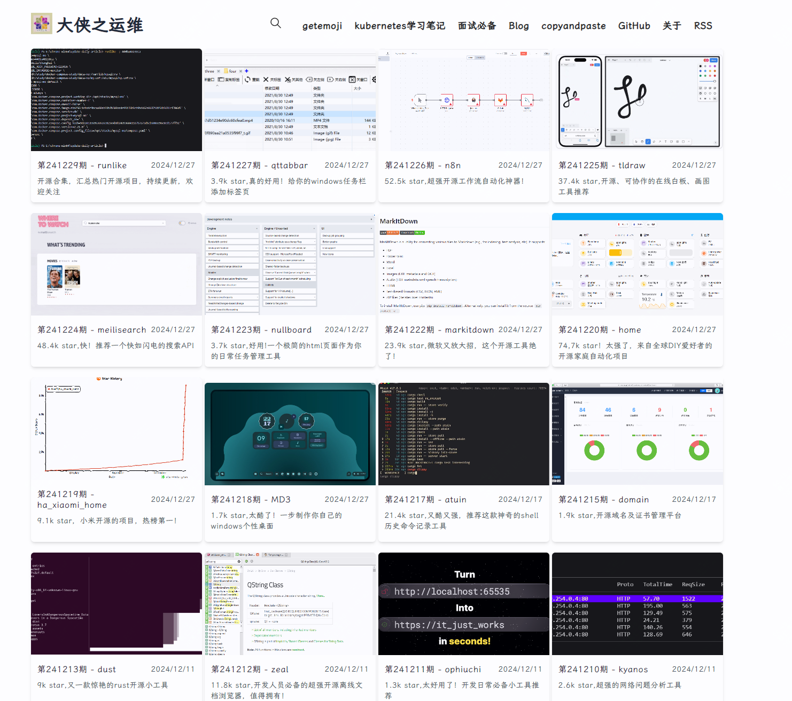

最近在看《曾国藩传》

印象最深的就是尚拙，曾国藩说：“天下之至拙，能胜天下之至巧”

因为想到了乔布斯，乔布斯说：“Stay Hungry, Stay Foolish”

同样的智慧，同样的道理，

拙，是拙，也是巧。

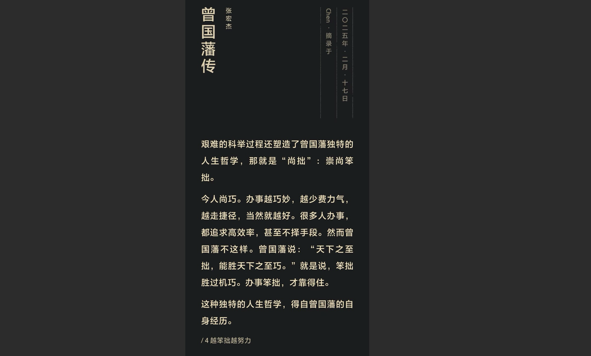

