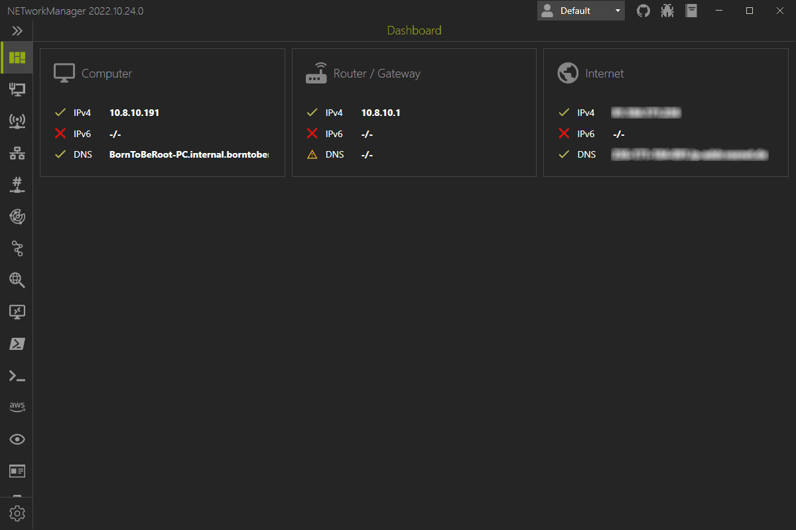

4.9k star，一款强大的网络工具，免费！

**NETworkManager: 网络管理与故障排除的强大工具**

在当今互联网时代，网络管理和故障排除是IT专业人员的重要技能。开源项目**NETworkManager**提供了一个强大的平台，以简化这些任务。本文将介绍这个项目，包括其简介、特点和如何快速开始使用。

**项目简介**

NETworkManager是一个开源工具，旨在帮助管理网络和解决网络问题。它由GitHub用户BornToBeRoot开发，并在GitHub上公开¹。这个项目利用.NET技术开发，提供了一个统一的界面来分析和排除网络和系统问题。

**核心特点**

- **多功能网络工具箱**：NETworkManager集成了多种网络工具，如WiFi分析器、IP扫描器、端口扫描器、Ping监视器、路由跟踪、DNS查找和LLDP/CDP捕获等。
- **远程系统管理**：用户可以通过远程桌面、PowerShell、PuTTY、TigerVNC或AWS（系统管理器）会话管理器连接和管理远程系统。
- **用户友好的界面**：提供了一个直观的用户界面，使得即使是非专业人士也能轻松地使用这些工具。
- **配置文件管理**：主机（或网络）可以保存在（加密的）配置文件中，并跨所有功能使用。

**快速开始**

要开始使用NETworkManager，用户可以从GitHub发布页面下载预构建和签名的二进制文件（安装程序、便携式和存档）。安装说明也在下载页面提供，包括静默安装选项¹。此外，NETworkManager还可以通过Chocolatey、WinGet和Evergreen等包管理器安装。

# Install via Chocolatey
choco install networkmanager

**结语**

NETworkManager是网络管理和故障排除的强大工具。它的开源性质意味着任何人都可以参与进来，帮助改进工具，使其更加强大和易用。无论你是IT专业人员还是对网络技术有兴趣的爱好者，NETworkManager都是一个值得尝试的项目。

以上就是对NETworkManager项目的介绍。如果你对网络管理和故障排除感兴趣，不妨尝试使用这个工具，它可能会成为你的得力助手。

>传送门：https://github.com/BornToBeRoot/NETworkManager
>
>官网：https://borntoberoot.net/NETworkManager/

